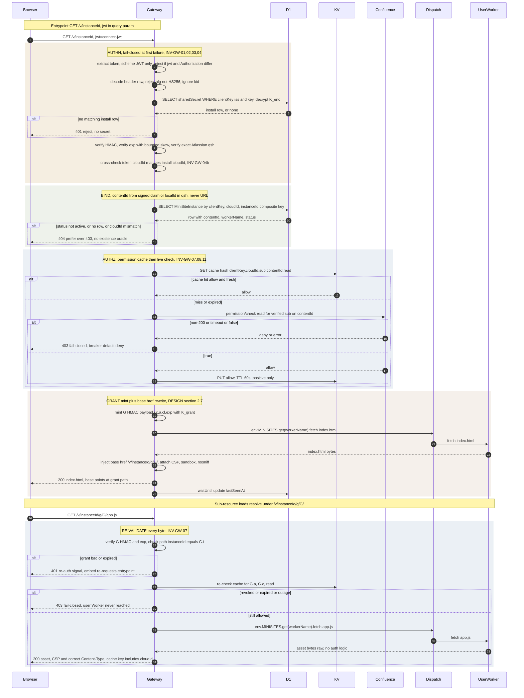
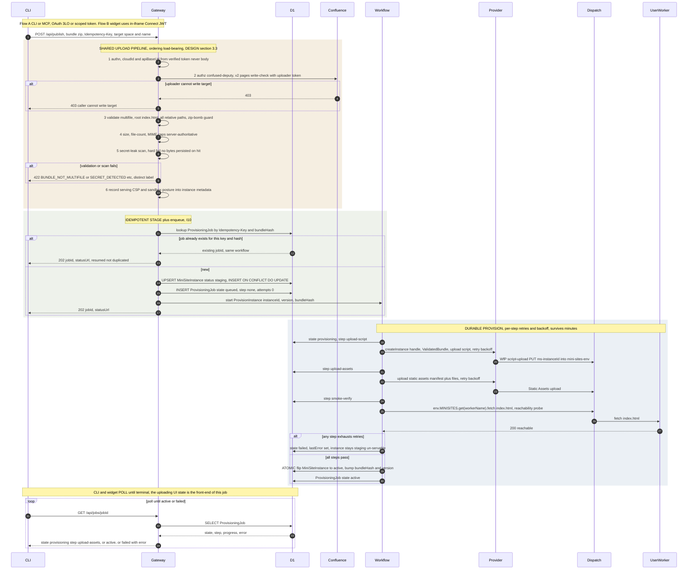
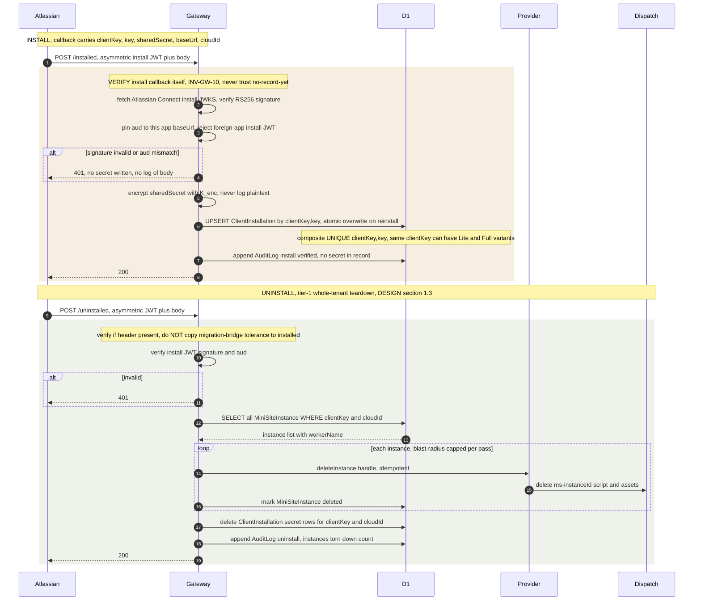
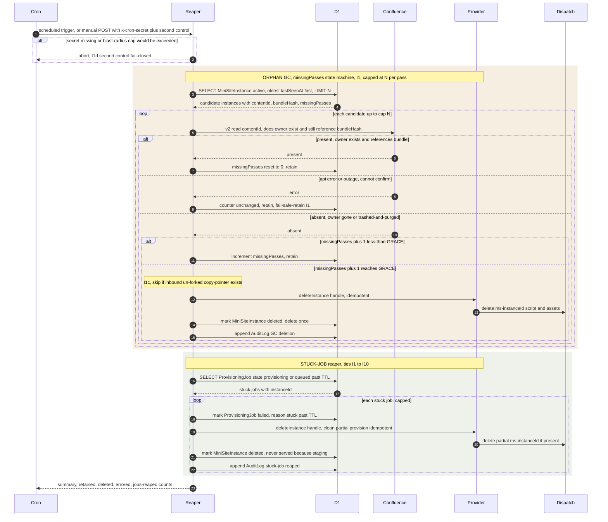
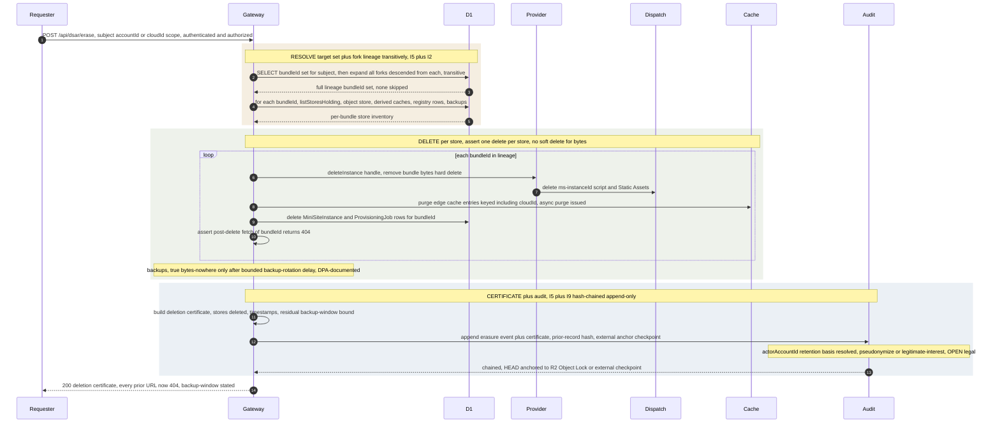
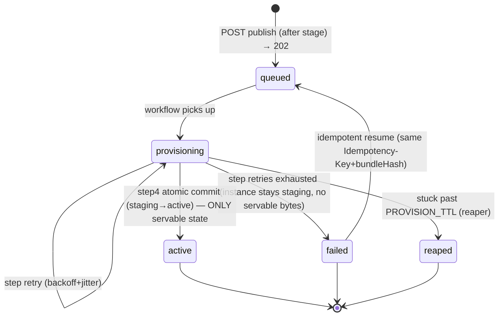

# Backend Blueprint: Conf Mini-Sites

> **Status: DESIGN ONLY — BUILD GATED.** The concrete realization layer beneath [`DESIGN.md`](DESIGN.md)
> (architecture, threat model, invariants) and [`IMPLEMENTATION_PLAN.md`](IMPLEMENTATION_PLAN.md) (staged plan).
> Product, gates, positioning: [`CONTEXT.md`](CONTEXT.md). This doc persists the *how it is wired* — data model,
> API surface, worker topology, sequence flows, and the error/jobs model — grounded in conf-app's real
> `functions/` idioms and consistent with DESIGN.md's vocabulary. No production code; build is gated.
>
> **Includes the async provisioning job** (DESIGN §3.4): publish returns `202 {jobId}`; a Cloudflare Workflows
> `ProvisionInstance` durable workflow spins up the user Worker; a `ProvisioningJob` table tracks state; the
> client polls `GET /api/jobs/{jobId}`.

> **Canonical resolutions (post-review).** A consistency panel caught drift between the parallel design
> sections; reconciled here so the blueprint is internally coherent:
> - **`ProvisioningJob` schema is single-source:** §1.4 / migration `0004_add_provisioning_job.sql` (with
>   `cloudId`, `step`, `workflowId`, `state` CHECK, and `UNIQUE(cloudId, idempotencyKey, bundleHash)` for the
>   I10/§3.4 DB-level idempotency guard). The earlier duplicate/weaker `0002` table was removed.
> - **Canonical `step` vocabulary:** `upload_script | upload_assets | smoke_verify | flip_active` (the wire
>   contract the CLI/widget poll on — underscored, no `finalize`/`activate` synonyms).
> - **Instance vs job status:** `MiniSiteInstance.status ∈ staging|provisioning|active|orphan_candidate|
>   quarantined|deleted`; `failed`/`reaped` are **job** states only — on job failure the instance stays
>   `staging` (un-servable), it does not get a `failed` instance status.
> - **`K_grant`** lives as a rotated Cloudflare **secret** (signing key), not an envelope-encrypted D1 column;
>   per-tenant `sharedSecret` is envelope-encrypted because it is bulk tenant data in D1, the CVE-class target.
> See the full panel findings in [Consistency review](#consistency-review-self-check-vs-designmd).

---

## Backend Blueprint — Data Model & Migrations

> Realization layer beneath `DESIGN.md`. Threat model and invariants are NOT re-derived here — this section
> persists the state those invariants act on. Cross-references are to `DESIGN.md`: §1.3 (lifecycle CRUD),
> §2.4–§2.7 (auth gateway: secret selection, grants), §3.3–§3.4 (upload pipeline + async provisioning job),
> §5.1 (lifecycle/fork/GC), §5.4 (DSAR/audit), §6 (HostingProvider seam).
>
> **Idiom basis (verified against conf-app):** prepared statements with positional `?N` binds and
> `INSERT … ON CONFLICT DO UPDATE` / `INSERT OR IGNORE` for idempotency (`functions/utils/dbUtils.ts`);
> `TEXT NOT NULL DEFAULT current_timestamp` timestamps and composite PKs (`0004_add-custom-content.sql`);
> the `UNIQUE(clientKey, key)` correction (`0008_fix_client_installation_unique_constraint.sql`);
> cloudId-keyed table (`0010_add_atlassian_instance.sql`); cloudId-namespaced KV/R2 keys
> (`license:${cloudId}:${spaceKey}`, `page-snapshots/${cloudId}/…`). Migrations are `functions/migrations/NNNN_*.sql`.

### 0. Persistence map (what lives where, and why)

| Store | Holds | Why this store | cloudId-namespaced? |
|---|---|---|---|
| **D1 `DB`** | `MiniSiteInstance`, `ClientInstallation`, `BundleVersion`, `ProvisioningJob`, `AuditLog`, `Idempotency` | Relational integrity, composite-key tenant binding (INV-GW-06), atomic commit (I10) | Yes — `cloudId` is a column in every multi-tenant table |
| **KV `PERM_CACHE_KV`** | positive `permission/check(read)` decisions, TTL ≤ 60s | Hot-path read cache, fail-closed (§2.6, I3) | Yes — `cloudId` in key |
| **KV `LICENSE_CACHE_KV`** | per-`cloudId` Marketplace/Connect license + tier | Tiering check (§6.2) without a synchronous Marketplace call per request | Yes — `cloudId` in key |
| **R2 `BUNDLE_STAGING_BUCKET`** | uploaded bundle bytes during `staging` → input to provisioning job | Holds bytes off the request path; GC'd on commit/fail (I10, §3.4) | Yes — `cloudId/` prefix |
| **R2 `AUDIT_ARCHIVE_BUCKET`** | rolled-up append-only audit segments + external hash-chain anchor | Tamper-evident archive + tail-truncation anchor (I9, §5.4) | Yes — `cloudId/` prefix |

D1 is the source of truth for *mappings and state*; R2 holds *bytes and immutable archives*; KV holds *short-TTL
decisions*. Bundle bytes never live in D1 (mirrors conf-app: the macro body stores a reference, the heavy
artifact lives elsewhere — §3.1).

---

### 1. D1 schema

#### 1.1 `MiniSiteInstance` — the instance↔content↔tenant binding (§1.3, INV-GW-06, I1/I2)

```sql
-- functions/migrations/0001_add_mini_site_instance.sql
CREATE TABLE IF NOT EXISTS MiniSiteInstance (
  clientKey     TEXT NOT NULL,                 -- Connect tenant identity (JWT iss); selects sharedSecret w/ key
  cloudId       TEXT NOT NULL,                 -- tenant isolation key (verified token, cross-checked to install)
  instanceId    TEXT NOT NULL,                 -- sha256(cloudId:macroLocalId) slug; stable PK for one mini-site
  workerName    TEXT NOT NULL,                 -- ms-<instanceId>; dispatch script name; NEVER client-visible
  contentId     TEXT NOT NULL,                 -- the Confluence content this instance is bound to (signed-claim source)
  spaceKey      TEXT,                           -- denormalized for write-check / space-scoped ops; nullable
  macroLocalId  TEXT NOT NULL,                 -- Connect per-macro localId; the identity component hashed into instanceId
  bundleHash    TEXT NOT NULL,                 -- content hash of CURRENT live bundle (change detection / idempotency)
  latestVersion INTEGER NOT NULL DEFAULT 0,    -- pointer into BundleVersion.version (0 = none live yet)
  status        TEXT NOT NULL                  -- 'staging'|'provisioning'|'active'|'orphan_candidate'|'quarantined'|'deleted'
                  CHECK (status IN ('staging','provisioning','active','orphan_candidate','quarantined','deleted')),
  scanStatus    TEXT,                           -- 'pending'|'clean'|'secret_detected'|'rescan_required' (I7)
  missingPasses INTEGER NOT NULL DEFAULT 0,    -- reconcile counter: consecutive passes owner confirmed absent (I1)
  forkedFromInstanceId TEXT,                    -- copy-on-access lineage: source instance (I2); NULL if original
  createdAt     TEXT NOT NULL DEFAULT current_timestamp,
  updatedAt     TEXT NOT NULL DEFAULT current_timestamp,
  lastSeenAt    TEXT,                           -- updated out-of-band on each authenticated view (orphan-GC input)
  deletedAt     TEXT,                           -- set when status flips to 'deleted' (DSAR/GC audit; soft marker only)
  -- [hardened] tenant binding is a DB-LEVEL composite key, not an app-layer WHERE (INV-GW-06):
  PRIMARY KEY (clientKey, cloudId, instanceId)
);
CREATE INDEX IF NOT EXISTS idx_minisite_cloud   ON MiniSiteInstance(cloudId);
CREATE INDEX IF NOT EXISTS idx_minisite_content  ON MiniSiteInstance(cloudId, contentId);
CREATE INDEX IF NOT EXISTS idx_minisite_orphan   ON MiniSiteInstance(status, lastSeenAt);
CREATE INDEX IF NOT EXISTS idx_minisite_fork     ON MiniSiteInstance(forkedFromInstanceId);
```

- **PK is `(clientKey, cloudId, instanceId)`** so a row is *physically* unreachable under another tenant's token —
  the IDOR defense (INV-GW-06) is a constraint, not a `WHERE` an impl can forget. The gateway lookup binds all
  three; never `WHERE instanceId = ?` alone.
- **`status`** drives serveability: the gateway serves **only `active`** (§3.4 — never `staging`/`provisioning`/
  `quarantined`/`orphan_candidate`/`deleted`). `CHECK` makes an illegal state a write error.
- **`forkedFromInstanceId`** records I2 fork lineage forward (source→copy is found by querying this column). It
  feeds (a) I1c inbound-copy-pointer retention and (b) I5 transitive erasure (DSAR must walk descendants).
- **`idx_minisite_content`** supports the reconcile probe (find all instances on a `contentId`) and copy-detection
  (a macro whose Confluence identity differs from the recorded owner → fork, §5.1/I2).

#### 1.2 `ClientInstallation` — per-install secret, app-encrypted (§2.4, INV-GW-04/10)

```sql
-- functions/migrations/0002_add_client_installation.sql
CREATE TABLE IF NOT EXISTS ClientInstallation (
  id                  INTEGER PRIMARY KEY AUTOINCREMENT,
  clientKey           TEXT NOT NULL,            -- Connect tenant identity (JWT iss)
  key                 TEXT NOT NULL,            -- app-variant key/descriptor key (Lite/Full); part of secret selection
  cloudId             TEXT NOT NULL,            -- cross-checked against verified-token cloudId (INV-GW-04b)
  baseUrl             TEXT NOT NULL,            -- tenant Confluence base URL (qsh baseUrl strip, REST calls)
  sharedSecretEnc     BLOB NOT NULL,            -- APP-LAYER ENCRYPTED sharedSecret (envelope/KMS-wrapped) — NEVER plaintext
  sharedSecretKeyId   TEXT NOT NULL,            -- which K_enc wrapped it (key rotation; envelope decrypt selector)
  productType         TEXT,                     -- 'confluence' (Connect product discriminator)
  status              TEXT NOT NULL DEFAULT 'active'
                        CHECK (status IN ('active','uninstalled')),
  installedAt         TEXT NOT NULL DEFAULT current_timestamp,
  updatedAt           TEXT NOT NULL DEFAULT current_timestamp,
  uninstalledAt       TEXT,
  -- [verified: 0008 dropped UNIQUE(clientKey), replaced with UNIQUE(clientKey,key)] same clientKey, multiple variants:
  UNIQUE (clientKey, key)
);
CREATE INDEX IF NOT EXISTS idx_install_cloud ON ClientInstallation(cloudId);
```

- **Secret selection keys on `(clientKey, key)`** — never `clientKey` alone (§2.4 step 2; the `0008` correction is
  load-bearing: one clientKey has Lite + Full rows with *different* secrets; `WHERE clientKey = ?` is
  non-deterministic). The gateway resolves the row by the *verified* `(iss, key/aud)` pair.
- **`sharedSecretEnc BLOB` + `sharedSecretKeyId`** — the single deliberate divergence from conf-app, whose
  `sharedSecret` is **plaintext `TEXT`** (`0005`, verified). INV-GW-10 requires application-layer envelope
  encryption (`K_enc`); the row stores ciphertext + the wrapping-key id so rotation works. A logged row or raw D1
  read discloses nothing usable.
- **`cloudId`** is stored at install time and is the authority the verified-token `cloudId` is checked against
  (INV-GW-04b — the HMAC proves `clientKey` only; `cloudId` is otherwise unauthenticated).
- **`installed` writes are gated solely on the verified asymmetric install JWT** (§2.4) — *not* "no row ⇒ trust".
  Reinstall overwrites `sharedSecretEnc` atomically. `uninstalled` flips `status='uninstalled'` and is the
  tenant-teardown trigger (§1.3) — but the gateway must NOT copy conf-app's `uninstalled.ts` missing-auth
  tolerance to the `installed` path (INV-GW-10).

#### 1.3 `BundleVersion` — immutable version log, idempotent re-publish, fork lineage (§3.3 step 7, I10/I2)

```sql
-- functions/migrations/0003_add_bundle_version.sql
CREATE TABLE IF NOT EXISTS BundleVersion (
  cloudId          TEXT NOT NULL,
  instanceId       TEXT NOT NULL,
  version          INTEGER NOT NULL,           -- monotonic per (cloudId, instanceId); latestVersion points here
  bundleHash       TEXT NOT NULL,              -- content-addressed hash of the validated bundle (idempotency key body)
  stagingKey       TEXT NOT NULL,              -- R2 object key under BUNDLE_STAGING_BUCKET holding the bytes
  entrypoint       TEXT NOT NULL DEFAULT 'index.html',
  totalBytes       INTEGER NOT NULL,
  fileCount        INTEGER NOT NULL,
  scanStatus       TEXT NOT NULL               -- 'pending'|'clean'|'secret_detected'|'rescan_required' (I7)
                     CHECK (scanStatus IN ('pending','clean','secret_detected','rescan_required')),
  scannerVersion   TEXT,                        -- scanner ruleset version (I7↔I10: bump re-quarantines)
  authorAccountId  TEXT NOT NULL,              -- attributable uploader (audit I9; OAuth/PAT or in-iframe JWT sub)
  forkedFromInstanceId TEXT,                    -- if this version was created by fork-on-copy (I2)
  forkedFromVersion    INTEGER,
  createdAt        TEXT NOT NULL DEFAULT current_timestamp,
  PRIMARY KEY (cloudId, instanceId, version)
);
CREATE INDEX IF NOT EXISTS idx_bundlever_hash ON BundleVersion(cloudId, instanceId, bundleHash);
```

- **Append-only**: re-publish inserts a new `version` row; `MiniSiteInstance.latestVersion` flips to it only at the
  atomic commit step. Mirrors conf-app's `CustomContentVersion` immutable-version idiom (`0004`) + the "version
  exists → skip" idempotent-resume discipline (`forge-custom-content.ts:44-67`, verified).
- **Idempotent re-publish**: the `(cloudId, instanceId, bundleHash)` index lets a retried publish with the same
  `Idempotency-Key`+`bundleHash` find the existing version and resume the *same* job instead of forking a new
  Worker (§3.4, I10). Insert uses `INSERT OR IGNORE` on the PK.
- **Fork lineage** (`forkedFromInstanceId`/`forkedFromVersion`) records copy-on-access provenance (I2) at the
  byte-version granularity, complementing `MiniSiteInstance.forkedFromInstanceId` (the live binding).

#### 1.4 `ProvisioningJob` — the §3.4 async provisioning job (I10, lives ABOVE the seam)

```sql
-- functions/migrations/0004_add_provisioning_job.sql
CREATE TABLE IF NOT EXISTS ProvisioningJob (
  jobId          TEXT PRIMARY KEY,             -- ulid/uuid; returned in 202 {jobId, statusUrl}
  cloudId        TEXT NOT NULL,                -- tenant scope (job listing/erasure is cloudId-namespaced, I8)
  instanceId     TEXT NOT NULL,
  version        INTEGER NOT NULL,             -- which BundleVersion this job provisions
  state          TEXT NOT NULL                 -- §3.4 lifecycle
                   CHECK (state IN ('queued','provisioning','active','failed')),
  step           TEXT,                          -- 'upload_script'|'upload_assets'|'smoke_verify'|'flip_active'
  attempts       INTEGER NOT NULL DEFAULT 0,   -- per-job retry counter (backoff input, I10 retry-storm bound)
  lastError      TEXT,                          -- last step error (surfaced via GET /api/jobs/{jobId}; NEVER secrets)
  idempotencyKey TEXT NOT NULL,                -- client Idempotency-Key; + bundleHash makes publish idempotent
  bundleHash     TEXT NOT NULL,                -- resume key: same idempotencyKey+bundleHash → same job (I10)
  workflowId     TEXT,                          -- Cloudflare Workflows instance id (substrate handle; §3.4)
  startedAt      TEXT NOT NULL DEFAULT current_timestamp,
  updatedAt      TEXT NOT NULL DEFAULT current_timestamp,
  -- idempotent enqueue: a retried publish with same key+hash MUST NOT create a second job/Worker (I10):
  UNIQUE (cloudId, idempotencyKey, bundleHash)
);
CREATE INDEX IF NOT EXISTS idx_job_instance ON ProvisioningJob(cloudId, instanceId);
CREATE INDEX IF NOT EXISTS idx_job_reaper   ON ProvisioningJob(state, updatedAt);
```

- **Decoupled from `MiniSiteInstance`** (§3.4): retries/history live here so the instance row stays clean. The
  instance stays `staging`/`provisioning` and **un-servable** until the workflow's final atomic step flips it to
  `active`.
- **`UNIQUE(cloudId, idempotencyKey, bundleHash)`** is the I10 idempotency guarantee at the DB level — a retried
  publish resolves to the existing job via `INSERT … ON CONFLICT DO UPDATE … RETURNING jobId`, never a duplicate
  Worker.
- **`idx_job_reaper`** serves the orphan reaper: jobs `state IN ('queued','provisioning')` with
  `updatedAt < now − TTL` are reaped (§3.4 orphan/stuck-job ties I1↔I10). The reaper is blast-radius-capped (I1d).
- **`step` + `attempts`** mirror the Cloudflare Workflows step state, surfaced verbatim by `GET /api/jobs/{jobId}`
  for CLI + widget polling (§3.4 contract). `lastError` is sanitized — never a secret/token (INV-GW-13).
- **`workflowId`** ties the row to the durable-execution substrate but is *substrate-specific*; the job *model*
  lives above the `HostingProvider` seam (§3.4) so the async manager survives the Forge pivot. A Queue-fallback
  substrate (§3.4) leaves `workflowId` NULL and uses the same row.

#### 1.5 `AuditLog` — append-only, hash-chained, externally anchored (I9, §5.4)

```sql
-- functions/migrations/0005_add_audit_log.sql
CREATE TABLE IF NOT EXISTS AuditLog (
  seq           INTEGER PRIMARY KEY AUTOINCREMENT, -- monotonic per-DB sequence; chain order
  ts            TEXT NOT NULL DEFAULT current_timestamp,
  cloudId       TEXT NOT NULL,                  -- tenant scope (DSAR/query is cloudId-namespaced, I8)
  actorAccountId TEXT,                           -- verified sub for the action (NULL for system/cron actions)
  action        TEXT NOT NULL,                  -- 'serve_allow'|'serve_deny'|'publish'|'scan_fail'|'fork_on_copy'|
                                                 --  'gc_delete'|'dsar_erase'|'cross_tenant_deny'|'install'|'uninstall'
  resourceId    TEXT,                            -- instanceId / contentId / jobId as relevant
  outcome       TEXT NOT NULL,                  -- 'allow'|'deny'|'ok'|'fail'
  reason        TEXT,                            -- ruleId / denial reason (NEVER secrets/full tokens, INV-GW-13)
  detail        TEXT,                            -- JSON: {ruleId, jwtExp, latencyMs, ...} — sanitized
  prevHash      TEXT NOT NULL,                   -- hash of the previous record's rowHash (chain link)
  rowHash       TEXT NOT NULL,                   -- H(seq||ts||cloudId||actor||action||resource||outcome||reason||detail||prevHash)
  CHECK (action IN ('serve_allow','serve_deny','publish','scan_fail','fork_on_copy',
                    'gc_delete','dsar_erase','cross_tenant_deny','install','uninstall'))
);
CREATE INDEX IF NOT EXISTS idx_audit_cloud  ON AuditLog(cloudId, ts);
CREATE INDEX IF NOT EXISTS idx_audit_actor  ON AuditLog(actorAccountId);  -- DSAR subject lookup (§5.4 OPEN: retention basis)
```

- **Append-only by API discipline + chain**: the only DB operation is `INSERT`; no path UPDATEs/DELETEs a row
  before retention (I9). conf-app has insert-only fact tables (`UserBehaviorEvent`, verified) but **no
  hash-chaining** — `prevHash`/`rowHash` add tamper-evidence.
- **Tail-truncation defense**: a hash chain in mutable D1 catches *middle* edits but not deletion of the newest
  rows (§5.4). The chain HEAD (`max(seq)`, `rowHash`) is periodically anchored to the external append-only
  `AUDIT_ARCHIVE_BUCKET` (R2 Object Lock) by the audit-roll cron, making tail-truncation detectable **[COST]**.
- **`actorAccountId` retention is an OPEN legal question** (§5.4 / open-question 9): a DSAR for the *subject* must
  reconcile with audit-immutability — pseudonymize vs legitimate-interest basis. The column exists; the policy is
  unresolved. Erasure of *content* (I5) does not erase the audit *record* of the erasure.

#### 1.6 `Idempotency` — request-level idempotency keys (§3.3 step 7, I10)

```sql
-- functions/migrations/0006_add_idempotency.sql
CREATE TABLE IF NOT EXISTS Idempotency (
  cloudId        TEXT NOT NULL,
  idempotencyKey TEXT NOT NULL,                 -- client-supplied Idempotency-Key header
  requestHash    TEXT NOT NULL,                 -- hash of the canonical request (detects key-reuse-different-body)
  jobId          TEXT,                          -- the ProvisioningJob this key resolved to (replay returns it)
  responseCode   INTEGER,                       -- cached 202/4xx for exact replay
  createdAt      TEXT NOT NULL DEFAULT current_timestamp,
  PRIMARY KEY (cloudId, idempotencyKey)
);
```

- Backs the publish endpoint's at-most-once semantics: a replayed `Idempotency-Key` with a matching `requestHash`
  returns the original `jobId`/`responseCode`; a mismatching `requestHash` (key reused for a different bundle) is a
  `409`. Complements the `ProvisioningJob` `UNIQUE(cloudId, idempotencyKey, bundleHash)` guard (job-level) with a
  request-level record (`forge-custom-content.ts:44-67` idempotent-resume idiom, generalized).

---

### 2. D1 access idioms (match conf-app `dbUtils.ts`)

All access via prepared statements with positional `?N` binds. Idempotent writes use upsert/`INSERT OR IGNORE`:

```sql
-- CREATE/UPDATE instance (race-safe; mirrors forge-custom-content.ts:62 ON CONFLICT DO UPDATE)
INSERT INTO MiniSiteInstance (clientKey, cloudId, instanceId, workerName, contentId, spaceKey,
                              macroLocalId, bundleHash, latestVersion, status, scanStatus)
VALUES (?1, ?2, ?3, ?4, ?5, ?6, ?7, ?8, ?9, ?10, ?11)
ON CONFLICT(clientKey, cloudId, instanceId) DO UPDATE SET
  bundleHash    = excluded.bundleHash,
  latestVersion = excluded.latestVersion,
  status        = excluded.status,
  scanStatus    = excluded.scanStatus,
  updatedAt     = current_timestamp;

-- GATEWAY LOOKUP — binds ALL THREE key columns (INV-GW-06); never WHERE instanceId alone:
SELECT workerName, contentId, status, latestVersion
FROM MiniSiteInstance
WHERE clientKey = ?1 AND cloudId = ?2 AND instanceId = ?3 AND status = 'active';

-- SECRET SELECTION — (clientKey, key), never clientKey alone (§2.4 step 2, the 0008 correction):
SELECT id, cloudId, baseUrl, sharedSecretEnc, sharedSecretKeyId
FROM ClientInstallation
WHERE clientKey = ?1 AND key = ?2 AND status = 'active';

-- IDEMPOTENT VERSION INSERT (forge-custom-content.ts:44-67 "version exists → skip"):
INSERT OR IGNORE INTO BundleVersion (cloudId, instanceId, version, bundleHash, stagingKey,
                                     entrypoint, totalBytes, fileCount, scanStatus, scannerVersion, authorAccountId)
VALUES (?1, ?2, ?3, ?4, ?5, ?6, ?7, ?8, ?9, ?10, ?11);

-- IDEMPOTENT JOB ENQUEUE (returns existing jobId on replay; I10):
INSERT INTO ProvisioningJob (jobId, cloudId, instanceId, version, state, idempotencyKey, bundleHash)
VALUES (?1, ?2, ?3, ?4, 'queued', ?5, ?6)
ON CONFLICT(cloudId, idempotencyKey, bundleHash) DO UPDATE SET updatedAt = current_timestamp
RETURNING jobId;
```

---

### 3. KV namespaces (cloudId in every key — I8)

| Binding | Key shape | Value | TTL | Posture |
|---|---|---|---|---|
| `PERM_CACHE_KV` | `perm:${cloudId}:${accountId}:${contentId}:read` | `"allow"` only | ≤ 60s | **Positive-only**, fail-closed; cache miss/outage ⇒ live check ⇒ deny on error (§2.6, I3, INV-GW-08/11). Key = hash of verified `(clientKey:cloudId:accountId:contentId:read)`; never a header-supplied id. |
| `LICENSE_CACHE_KV` | `license:${cloudId}` | `{tier, capabilitySet, exp}` | ≤ 1h | Tiering check (§6.2). Mirrors conf-app `license:${cloudId}:${spaceKey}` namespacing (verified). |

Key-builder must be a single function with a unit test asserting it **cannot** emit a key missing `cloudId`
(I8 [hardened] — an omitted `cloudId` is a cross-tenant cache poison). The same property is asserted for the
**edge/Cache-API key** used for bundle bytes (§4 of DESIGN.md: any Cache-API entry for bundle bytes MUST include
`cloudId`).

---

### 4. R2 buckets (cloudId-prefixed keys — I8)

| Binding | Key shape | Holds | Lifecycle |
|---|---|---|---|
| `BUNDLE_STAGING_BUCKET` | `${cloudId}/${instanceId}/${version}/<relpath>` | validated bundle bytes awaiting provisioning | written at stage; read by provisioning job; **deleted on commit success or job fail** (I10). Stuck objects GC'd by orphan reaper. |
| `AUDIT_ARCHIVE_BUCKET` | `${cloudId}/audit/${yyyy-mm}/segment-${seq}.jsonl` + `anchor/${yyyy-mm-dd}.json` | rolled-up append-only audit segments + chain-HEAD anchor | **R2 Object Lock (WORM)** for tamper-proofing + tail-truncation anchor (I9, §5.4). Retention bounded; DSAR-aware. |

R2 key prefixes are `cloudId/` (mirrors conf-app `page-snapshots/${cloudId}/…`, verified) so a key built from
tenant A's context can never address tenant B's object. DSAR erasure (I5) enumerates objects under
`${cloudId}/${instanceId}/` **and transitively for every fork descendant** (`MiniSiteInstance.forkedFromInstanceId`
walk) — `listStoresHolding(bundleId)` is per-instance and would miss forks (§5.4 [hardened]).

---

### 5. Ordered migration filenames

| # | File | Creates | Notes |
|---|---|---|---|
| 0001 | `0001_add_mini_site_instance.sql` | `MiniSiteInstance` + 4 indexes | composite PK `(clientKey,cloudId,instanceId)` |
| 0002 | `0002_add_client_installation.sql` | `ClientInstallation` + cloud index | `UNIQUE(clientKey,key)`; `sharedSecretEnc BLOB` (encrypted) |
| 0003 | `0003_add_bundle_version.sql` | `BundleVersion` + hash index | append-only; fork lineage |
| 0004 | `0004_add_provisioning_job.sql` | `ProvisioningJob` + 2 indexes | `UNIQUE(cloudId,idempotencyKey,bundleHash)`; reaper index |
| 0005 | `0005_add_audit_log.sql` | `AuditLog` + 2 indexes | hash-chained; actor index for DSAR |
| 0006 | `0006_add_idempotency.sql` | `Idempotency` | request-level at-most-once |

Numbering restarts at `0001` because this is a **separate D1 database** in its own dispatch-Worker project, not an
extension of conf-app's DB (conf-app is Forge-only, no Connect/WfP path). KV/R2 bindings are declared per-env in
`wrangler-{dev,stg,prod}.toml` mirroring conf-app's per-env split (the dispatch namespace `mini-sites-<env>` and
D1 `DB` binding live in the same files).

---

### 6. What each invariant pins to which table/column

| Invariant | Persistence anchor |
|---|---|
| INV-GW-04/04b (secret + cloudId cross-check) | `ClientInstallation.(clientKey,key)` + `.cloudId` |
| INV-GW-06 (DB-level tenant bind / IDOR) | `MiniSiteInstance` PK `(clientKey,cloudId,instanceId)` |
| INV-GW-08/11 (fail-closed perm cache) | `PERM_CACHE_KV` positive-only ≤60s |
| INV-GW-10 (secret at rest) | `ClientInstallation.sharedSecretEnc` BLOB + `.sharedSecretKeyId` |
| INV-GW-13 (no secrets logged) | `AuditLog.reason/detail` sanitized; lint+test enforced |
| I1 (orphan GC) | `MiniSiteInstance.(status,lastSeenAt,missingPasses)` + `idx_minisite_orphan` |
| I1c (inbound-copy retention) | `MiniSiteInstance.forkedFromInstanceId` |
| I2 (fork-on-copy) | `MiniSiteInstance.forkedFromInstanceId` + `BundleVersion.forkedFrom*` |
| I5 (DSAR transitive erasure) | fork-lineage walk + R2 `${cloudId}/${instanceId}/` delete |
| I7 (secret scan) | `MiniSiteInstance.scanStatus` + `BundleVersion.scanStatus/scannerVersion` |
| I8 (tenant isolation) | `cloudId` column/prefix in every table, KV key, R2 key |
| I9 (audit) | `AuditLog` chain + R2 `AUDIT_ARCHIVE_BUCKET` anchor |
| I10 (partial-failure / idempotency) | `ProvisioningJob` UNIQUE + `Idempotency` + `BundleVersion` append-only + `status` CHECK |

**Open questions (this section):**
- DSAR vs audit retention (DESIGN open-Q 9 / §5.4): AuditLog.actorAccountId of an erased subject — pseudonymize on DSAR vs retain under legitimate-interest? The column exists but the legal basis is unresolved; erasure of content (I5) must not erase the audit record of the erasure itself. Blocks finalizing the AuditLog retention/redaction policy.
- Backup-retention bound (DESIGN open-Q 10 / I5): provable 'bytes exist nowhere' for D1 + R2 depends on Cloudflare's backup-rotation window — must be confirmed with Cloudflare and written into the DPA before I5 erasure can claim completeness. Affects whether a soft-delete grace + bounded backup delay is acceptable.
- K_enc key management for ClientInstallation.sharedSecretEnc / K_grant: where the envelope/wrapping key lives (Cloudflare Secrets Store binding vs external KMS), rotation cadence, and how sharedSecretKeyId selects the unwrapper. The schema carries the keyId; the KMS substrate is unspecified.
- contentId signed-claim (DESIGN open-Q 5): MiniSiteInstance.contentId is the bind target, but the exact HMAC/qsh-covered claim that yields contentId for this iframe type is unnamed — if none exists, re-derive from macroLocalId in qsh. Determines whether contentId is a stored authority or a derived one.
- Whether ProvisioningJob.workflowId stays in the same table under the Queue-fallback substrate (§3.4) or moves to a substrate adapter — the job model is above the seam but workflowId is substrate-specific; clean Forge-pivot insulation may want it factored out.
- AVI event reliability (DESIGN open-Q 7): whether copy/export AVI events fire reliably enough to drive eager fork (I2) writes to forkedFromInstanceId, vs lazy fork-on-first-authenticated-render. Affects when the fork-lineage columns get populated.

---

## 7. Backend Realization Blueprint — worker topology, bindings, secrets, provider & provisioning workflow

> Realization layer for §1–§6. This section does **not** re-derive the threat model or invariants — it names the
> concrete deployable units, their Cloudflare bindings, secret storage/rotation, the `CloudflareWfPProvider`
> wiring against the WfP script-upload/dispatch APIs, the **`ProvisionInstance` Cloudflare Workflow** (the §3.4
> durable async job), and the CI import-boundary that protects §6's seam. Where a control closes a §2/§5
> invariant, the invariant tag (`INV-GW-*`, `I1`–`I10`, `INV-SEAM-*`) is cited rather than restated.

### 7.1 Deployable units (six) and why they split this way

conf-app ships **two** wrangler shapes [verified]: a **Pages project** (`wrangler-prod.toml`:
`pages_build_output_dir = "dist"`, **no `main`**, bindings under `env.production.*`) and a **standalone module
Worker** (`workers/cron-aggregate/wrangler.toml`: `main = "src/index.ts"`, `account_id`, per-env
`[env.X.triggers] crons`). Mini-Sites needs **both shapes plus a new one** — a module Worker that holds a
`dispatch_namespaces` binding and calls `env.MINISITES.get(name).fetch()`. **Pages cannot host the dispatch
gateway**: the WfP dispatch binding + programmatic sub-request routing belong in a module Worker, not a
Pages-Functions project. The six units:

| # | Unit | Wrangler shape | Routable? | Holds | Closes |
|---|------|----------------|-----------|-------|--------|
| 1 | **Dispatch Worker** (`ms-dispatch`) — auth gateway, §2 + §4 serving | module Worker, public route | **Yes** (the *only* public entry) | `dispatch_namespaces` + D1 `DB` + KV + R2 + secrets | INV-GW-01..15, I3/I4/I6/I8 |
| 2 | **User Workers** (`ms-<instanceId>`) — Static Assets per bundle | module Worker uploaded **into** the namespace via WfP API (no wrangler file) | **No** — no route/subdomain/domain (config policy) | only its own static assets | INV-GW-14 (non-routability) |
| 3 | **Provision Workflow** (`ms-provision`) — §3.4 durable job | module Worker, `[[workflows]]` binding | No public route (invoked by the publish Pages Function via binding) | `dispatch_namespaces` (to upload user scripts) + D1 + secrets | I10, §3.4 idempotency |
| 4 | **Reconcile Cron** (`ms-reconcile`) — orphan reaper, §1.3/§5.1 | module Worker, `[env.X.triggers] crons` (cron-aggregate shape) | No public route | D1 + KV + `CRON_SECRET` + Confluence creds | I1/I1a–I1d, I5 sweep |
| 5 | **Pages Functions** (`ms-app`) — publish / lifecycle / OAuth / job-status | Pages project, `pages_build_output_dir` | Yes | D1 + KV + secrets + Workflow binding | §3.1–§3.4, INV-GW-10 (installed) |
| 6 | **Provision Queue + consumer** (`ms-provision-queue`) — **fallback substrate** for unit 3 | module Worker, `[[queues.consumers]]` | No public route | same as unit 3 | §3.4 fallback if Workflows unavailable in an env |

**One dispatch namespace per environment:** `mini-sites-dev` / `mini-sites-stg` / `mini-sites-prod`, mirroring
conf-app's per-env D1/KV split across `wrangler-{dev,stg,prod}.toml` [verified]. Units 1, 3, 4, 6 are
**standalone module Workers** (cron-aggregate shape: `main`, `account_id`, per-env `[env.X]` blocks). Unit 5 is
the **Pages project** (conf-app `wrangler-prod.toml` shape). Unit 2 is **never** described by a wrangler file —
it is produced by the WfP **script-upload API** at provision time (§7.4).

### 7.2 Representative `wrangler-prod.toml` excerpts (per unit)

**Unit 1 — Dispatch Worker (`ms-dispatch`)** — the only public-routable worker; holds the namespace binding:

```toml
# dispatch/wrangler-prod.toml  (module Worker — cron-aggregate shape, NOT Pages)
name = "ms-dispatch-prod"
main = "src/index.ts"
account_id = "8d5fc7ce04adc5096f52485cce7d7b3d"   # same account as conf-app [verified]
compatibility_date = "2024-11-11"
compatibility_flags = ["nodejs_compat"]

[env.production]
name = "ms-dispatch-prod"
routes = [{ pattern = "mini-sites.zenuml.com/*", zone_name = "zenuml.com" }]

# WfP: the per-env dispatch namespace the gateway routes into (NON-ROUTABLE user Workers live here)
[[env.production.dispatch_namespaces]]
binding   = "MINISITES"
namespace = "mini-sites-prod"

# State — same binding NAMES & shape as conf-app wrangler-prod.toml:23-43 [verified]
[[env.production.d1_databases]]
binding = "DB"
database_name = "ms-zenuml-prod"
database_id = "<prod-d1-id>"
migrations_dir = "functions/migrations"

[[env.production.kv_namespaces]]
binding = "CLIENT_INSTALLATION_KV"   # per-(clientKey,key) install secret cache (envelope-encrypted, §7.5)
id = "<prod-kv-install-id>"

[[env.production.kv_namespaces]]
binding = "PERM_CACHE_KV"            # positive-only permission decisions, TTL<=60s, fail-closed (INV-GW-08/11)
id = "<prod-kv-perm-id>"

[[env.production.r2_buckets]]
binding = "AUDIT_BUCKET"             # append-only hash-chained audit archive (I9); Object-Lock anchor
bucket_name = "ms-audit-prod"

# Secrets (NOT in this file): K_ENC, K_GRANT_CURRENT, K_GRANT_PREVIOUS — see §7.5
```

**Unit 3 — Provision Workflow (`ms-provision`)** — durable async job; can upload user scripts:

```toml
# provision/wrangler-prod.toml
name = "ms-provision-prod"
main = "src/index.ts"
account_id = "8d5fc7ce04adc5096f52485cce7d7b3d"
compatibility_date = "2024-11-11"
compatibility_flags = ["nodejs_compat"]

[env.production]
name = "ms-provision-prod"

[[env.production.workflows]]
name       = "ms-provision-instance-prod"
binding    = "PROVISION"                       # bound INTO unit 5 (Pages) so publish can .create()
class_name = "ProvisionInstance"

[[env.production.dispatch_namespaces]]
binding   = "MINISITES"                         # upload user Worker scripts into the namespace
namespace = "mini-sites-prod"

[[env.production.d1_databases]]
binding = "DB"
database_name = "ms-zenuml-prod"
database_id = "<prod-d1-id>"
migrations_dir = "functions/migrations"
# Secret: WFP_API_TOKEN (script-upload), K_ENC (read sharedSecret for smoke-verify) — §7.5
```

**Unit 4 — Reconcile Cron (`ms-reconcile`)** — exact cron-aggregate shape [verified], net-new reconcile logic:

```toml
# reconcile/wrangler.toml  (mirrors workers/cron-aggregate/wrangler.toml line-for-line)
name = "ms-reconcile"
main = "src/index.ts"
account_id = "8d5fc7ce04adc5096f52485cce7d7b3d"
compatibility_date = "2024-11-11"
compatibility_flags = ["nodejs_compat"]

[env.production]
name = "ms-reconcile-prod"

[env.production.triggers]
crons = ["0 3 * * *"]                           # 03:00 UTC (offset from conf-app's 02:00 aggregate)

[[env.production.dispatch_namespaces]]
binding   = "MINISITES"                          # to deleteInstance() orphaned user Workers
namespace = "mini-sites-prod"

[[env.production.d1_databases]]
binding = "DB"
database_name = "ms-zenuml-prod"
database_id = "<prod-d1-id>"
# Secrets: CRON_SECRET (manual-trigger gate, conf-app x-cron-secret pattern), CONFLUENCE_RECON_* (§7.5)
```

**Unit 5 — Pages Functions (`ms-app`)** — conf-app `wrangler-prod.toml` shape; binds the Workflow + dispatch:

```toml
# wrangler-prod.toml  (Pages — pages_build_output_dir, NO `main`, exactly conf-app's shape)
name = "ms-app-prod"
pages_build_output_dir = "dist"
compatibility_date = "2024-11-11"
compatibility_flags = ["nodejs_compat"]

[env.production.vars]
ENVIRONMENT = "production"
CONFLUENCE_PERMISSION_API = "v2"

[[env.production.d1_databases]]
binding = "DB"
database_name = "ms-zenuml-prod"
database_id = "<prod-d1-id>"
migrations_dir = "functions/migrations"

[[env.production.kv_namespaces]]
binding = "CLIENT_INSTALLATION_KV"
id = "<prod-kv-install-id>"

# Publish handler calls env.PROVISION.create({...}) to launch the §3.4 job
[[env.production.workflows]]
binding    = "PROVISION"
script_name = "ms-provision-prod"               # cross-script workflow binding
class_name = "ProvisionInstance"
# Secrets: K_ENC, OAUTH_CLIENT_SECRET, OAUTH_CLIENT_ID, ATLASSIAN_CONNECT_* — §7.5
```

**Unit 2 — User Worker (`ms-<instanceId>`)** has **no wrangler file**. Its config policy is enforced at upload
(§7.4): the WfP script-upload metadata sets **no route, no `workers_dev` subdomain, no custom domain**, with
only a Static-Assets manifest. Non-routability is asserted at upload time **and** verified by the pen-test's
direct-probe (INV-GW-14, §2.6/§5.2 pen-test rider).

### 7.3 Bindings matrix (which unit gets what, and why)

| Binding | Type | 1 Dispatch | 3 Provision | 4 Reconcile | 5 Pages | Rationale |
|---|---|:--:|:--:|:--:|:--:|---|
| `MINISITES` | dispatch_namespace | ✅ get().fetch | ✅ upload | ✅ delete | — | serve / provision / reap user Workers |
| `DB` | D1 | ✅ | ✅ | ✅ | ✅ | `MiniSiteInstance`, `ProvisioningJob`, `AuditLog` (§7.7) |
| `CLIENT_INSTALLATION_KV` | KV | ✅ | — | — | ✅ | per-`(clientKey,key)` install secret cache (D1 is source of truth) |
| `PERM_CACHE_KV` | KV | ✅ | — | — | — | positive-only perm cache, TTL≤60s, fail-closed (INV-GW-08/11) |
| `AUDIT_BUCKET` | R2 | ✅ | ✅ | ✅ | ✅ | hash-chained audit archive + external anchor (I9) |
| `PROVISION` | Workflow | — | (self) | — | ✅ | publish → `env.PROVISION.create()` (§3.4) |
| `PROVISION_QUEUE` | Queue (fallback) | — | — | — | ✅ | fallback if Workflows absent in an env (§3.4) |

KV namespaces are referenced by **binding name** with per-env `id`s, exactly as conf-app keys
`SPACE_LICENSE_KV` / `CLIENT_INSTALLATION_KV` across `wrangler-{dev,stg,prod}.toml` [verified]. D1 `DB`,
migrations under `functions/migrations/NNNN_*.sql` (conf-app convention [verified]).

### 7.4 `CloudflareWfPProvider` wiring (below the §6 seam)

`CloudflareWfPProvider implements HostingProvider` (§6.1). It is the **only** module permitted to import a
Cloudflare SDK / call the WfP REST API (enforced by INV-SEAM-01, §7.6). Mapping of seam methods to WfP:

| Seam method (§6.1) | Cloudflare mechanism | Notes |
|---|---|---|
| `createInstance(handle, bundle)` | **WfP script-upload API** — `PUT /accounts/{acct}/workers/dispatch/namespaces/mini-sites-{env}/scripts/ms-{instanceId}` (multipart: ES-module entry + static-asset manifest + files) | idempotent on script name (§1.3 UPDATE = same `workerName`, single overwrite); auth = `WFP_API_TOKEN` (§7.5) |
| `updateBundle(handle, bundle)` | same `PUT` (overwrite); bump `bundleHash` | atomic from viewer POV: gateway serves old until `MiniSiteInstance.status` flips `active` |
| `deleteInstance(handle)` | `DELETE .../scripts/ms-{instanceId}` | idempotent — GC (unit 4) calls blind; 404 from WfP = success |
| `serve(handle, filePath, auth)` | `env.MINISITES.get("ms-"+instanceId).fetch(req)` | **dispatch binding, not a route** — the non-routability primitive (INV-GW-14) |
| `verifyHostToken(rawToken)` | Connect **HS256/qsh** verify (§2.4) — greenfield | Forge variant swaps to JWKS; selected by `permissionModel` |
| `permissionModel` | `'app-enforced'` | drives which §5 invariants apply (Forge = `'inherited'`, §6.2) |
| `capabilities` | `{ maxFileBytes, supportsServerSideServe: true, nativeRelativePaths: true }` | INV-SEAM-03 asserts these per provider |

**Upload config policy (the non-routability enforcement, INV-GW-14):** the script-upload metadata sets
`{ "compatibility_date": ..., "main_module": ..., "assets": { manifest }, }` and **omits any route /
`workers_dev` / custom-domain field**. WfP dispatch-namespace scripts have no public route by default; the
provider asserts this explicitly and the CI contract-test (INV-SEAM-03) + pen-test direct-probe verify it. The
gateway reaches the script **only** via `env.MINISITES.get(name).fetch()`; a guessed `workerName` resolves to
nothing (§1.2).

### 7.5 Secrets & keys — storage, rotation, never-logged

All secrets live in **Cloudflare secrets** (`wrangler secret put` for module Workers; `wrangler pages secret
put --project-name=ms-app-prod` for the Pages unit — exactly conf-app's documented idiom, `docs/ops/
cloudflare-pages.md` + `wrangler-dev.toml:12` [verified]). **Never** in `[vars]`, never in a `.toml`, never
logged.

| Secret | Unit(s) | Purpose | Rotation | Closes |
|---|---|---|---|---|
| `K_ENC` | 1, 3, 5 | envelope/KMS-wrap key for `sharedSecret` + `K_grant` at rest (D1 default encryption is insufficient — INV-GW-10) | dual-key window: `K_ENC_CURRENT` + `K_ENC_PREVIOUS`; re-wrap rows lazily on read | INV-GW-10 |
| `K_GRANT_CURRENT` / `K_GRANT_PREVIOUS` | 1 | HMAC signing key for signed-path **grant tokens** (§2.7) | rotated; gateway **verifies against both** current+previous, **mints only with current**; grant TTL≤60s bounds the cutover | §2.7, §5.5 |
| `CRON_SECRET` | 4 | gate for manual reconcile trigger via `x-cron-secret` header (conf-app `aggregate-events.ts:18-19` pattern [verified]) | rotated; **plus** I1d blast-radius cap so a leaked secret ≠ mass delete | I1d, §5.5 |
| `WFP_API_TOKEN` | 3, 4 | WfP script-upload/delete REST auth | rotated; scoped to the namespace + Workers Scripts edit | §7.4 |
| `OAUTH_CLIENT_ID` / `OAUTH_CLIENT_SECRET` | 5 | Flow A 3LO device-grant client (§3.1) | rotated per Atlassian policy | §3.1 [GATED] |
| `ATLASSIAN_CONNECT_INSTALL_AUD` | 5 | pinned `aud` for the `installed` callback verify (INV-GW-10) | static per app identity | INV-GW-10 |

**`sharedSecret` at rest:** stored in `MiniSiteInstance`-adjacent `ClientInstallation` as **app-layer
envelope-encrypted ciphertext** keyed by `(clientKey, key)` — **not** plaintext `TEXT` (corrects conf-app
migration 0005 [verified]; INV-GW-10). The KV `CLIENT_INSTALLATION_KV` caches the *encrypted* blob; decryption
happens only in-memory at verify time.

**Never-logged enforcement (structural, INV-GW-13):** an ESLint `no-restricted-syntax`/custom rule bans
`console.log`/`console.error` arguments that transitively reference `sharedSecret`, `K_enc`, `K_grant`, the
decoded JWT, or the `installed`/lifecycle body — directly closing the conf-app anti-patterns
(`authenticate.ts:28` logs the decoded token; `forge-installed.ts:34` logs the full lifecycle body [verified],
which for classic Connect *contains the sharedSecret*). This rule **must lint `functions/`** (conf-app's
`eslint.config.mjs` ignores `functions/` [verified] — do not inherit that).

### 7.6 CI import boundary (protects the §6 seam — INV-SEAM-01)

conf-app is **live evidence the seam rots without a gate** [verified]: it imports `@forge/bridge` from 15+
non-test modules, has `rules: {}` in `.eslintrc.js`, and its `eslint.config.mjs` **ignores `functions/`**. So
the boundary is built day-one, two redundant layers:

```js
// .dependency-cruiser.cjs — forbid Cloudflare/Forge SDKs above the hosting seam
forbidden: [{
  name: "no-host-sdk-above-seam",
  severity: "error",
  from: { pathNot: "^src/hosting/" },
  to:   { path: "node_modules/(@cloudflare|@forge|wrangler)/" },
}]
```

```js
// eslint.config.mjs — REMOVE conf-app's functions/ ignore; lint backend too
{ files: ["src/**", "functions/**"],            // <-- functions/ explicitly INCLUDED
  rules: { "no-restricted-imports": ["error", { patterns: [
    { group: ["@cloudflare/*", "@forge/*"], message: "Host SDK only under src/hosting/ (INV-SEAM-01)" }
  ]}]}}
```

Both run in CI and **fail the build**. Plus the per-provider **contract-test pack** (INV-SEAM-03): asserts
`capabilities.nativeRelativePaths`, `supportsServerSideServe`, and the **as-served CSP/sandbox posture** so a
`ForgeProvider` that silently degrades the core multi-file capability fails CI.

### 7.7 `ProvisionInstance` Workflow (the §3.4 durable async job) + DB rows

The publish Pages Function (unit 5) validates+stages, then `await env.PROVISION.create({ id: idempotencyKey,
params: { instanceId, version, bundleHash, ... } })` and returns **`202 { jobId, statusUrl }`** (§3.4).
`GET /api/jobs/{jobId}` reads the `ProvisioningJob` row. The workflow (unit 3) runs durable steps with per-step
retry+backoff:

```ts
// provision/src/index.ts — Cloudflare Workflow (durable; survives minutes/restarts)
export class ProvisionInstance extends WorkflowEntrypoint<Env, ProvisionParams> {
  async run(event, step) {
    const p = event.payload;
    // upload_script + upload_assets: provider.createInstance uploads the script module and the WfP
    // Static-Assets bundle below the seam; job.step reports upload_script then upload_assets
    await step.do("upload_script", { retries: { limit: 5, backoff: "exponential" } },
      () => this.provider.createInstance(handle(p), p.bundle));
    // smoke_verify: confirm reachable via dispatch (INV-GW-14 positive: it IS reachable internally)
    await step.do("smoke_verify", { retries: { limit: 5, backoff: "exponential" } },
      () => this.smokeVerify(p.instanceId));
    // flip_active: ATOMIC flip — instance becomes servable ONLY here (I10)
    await step.do("flip_active", () => this.db.activate(p.instanceId, p.version, p.bundleHash));
  }
}
```

**Job model (`ProvisioningJob`)** is decoupled from `MiniSiteInstance` so retries/history don't muddy the
instance row (§3.4). The instance stays `staging`/un-servable until step 3 flips it `active`; the gateway never
serves `staging`/`provisioning` (I10).

> **`ProvisioningJob` schema — canonical in §1.4 / migration `0004_add_provisioning_job.sql`** (Data Model).
> It carries `cloudId`, the `step` enum (`upload_script|upload_assets|smoke_verify|flip_active`), `workflowId`,
> a `state` CHECK (`queued|provisioning|active|failed`), and the DB-level idempotency guard
> `UNIQUE(cloudId, idempotencyKey, bundleHash)` with `ON CONFLICT DO UPDATE … RETURNING jobId`. The orphan
> reaper reads its `idx_job_stuck` index. (An earlier draft re-emitted a weaker table here at migration `0002`,
> which collided with `ClientInstallation` and dropped the idempotency UNIQUE — removed.)

**Idempotency (§3.4):** the dedup key is `(cloudId, idempotencyKey, bundleHash)` (enforced by the UNIQUE on the
§1.4 table); a retried publish with the same `(Idempotency-Key, bundleHash)` resumes the same job, never a
duplicate user Worker (I10); same key + a *different* `bundleHash` is an `IDEMPOTENCY_CONFLICT (409)`. **Orphan reaper (unit 4)** reaps jobs
stuck in `provisioning` past TTL via `idx_job_stuck` (ties I1 ↔ I10). **Fallback:** if Workflows is
unavailable in an env, the publish handler enqueues to `PROVISION_QUEUE` and the consumer (unit 6) runs the
same three steps with hand-rolled state in `ProvisioningJob` — the **job manager lives above the
HostingProvider seam**, so the async manager survives the Forge pivot unchanged (§3.4).

### 7.8 Lifecycle wiring (where it lands across units)

- **`installed`** (unit 5 Pages Function): verify Atlassian-signed asymmetric install JWT, **pin `aud`**,
  envelope-encrypt + store `sharedSecret` by `(clientKey, key)` (INV-GW-10). **Must NOT** copy conf-app
  `uninstalled.ts:24-26`'s missing-auth tolerance to this path [verified].
- **`uninstalled`** (unit 5): tenant-wide teardown — mark instances `deleted`, enqueue provider
  `deleteInstance` for the tenant's user Workers, DSAR-style transitive erasure of forks (I5).
- **Reconcile cron** (unit 4): per-instance orphan GC with fail-safe-retain on API error (I1/I1a–I1d), I1d
  blast-radius cap, transitive fork erasure sweep (I5). Net-new reconcile logic atop the cron-aggregate
  skeleton [verified].
- **Audit** (all units write, R2 `AUDIT_BUCKET` + D1): append-only hash-chained, HEAD/length pinned to an
  external append-only anchor (R2 Object-Lock) for tail-truncation detection (I9).

**Open questions (this section):**
- WfP script-upload API surface for Static Assets: confirm the exact multipart manifest format and the metadata field that asserts no-route/no-workers_dev/no-custom-domain for dispatch-namespace scripts (the INV-GW-14 enforcement lever). Needs verification against current Cloudflare WfP API docs before CloudflareWfPProvider.createInstance is implemented.
- Cloudflare Workflows availability + cross-script binding: confirm Workflows is available in all three target envs (dev/stg/prod) and that a Pages project can bind a Workflow defined in a separate module Worker via script_name. If not, units 3/6 collapse to the Queue+consumer fallback only.
- K_ENC backing: decide whether envelope encryption uses a Cloudflare-stored raw key (wrangler secret) or an external KMS. The DESIGN says envelope/KMS-wrapped; the concrete key-custody + rotation mechanism (re-wrap on read vs migration) is unspecified.
- Per-env dispatch namespace creation: dispatch namespaces are account-level resources created out-of-band (wrangler dispatch-namespace create or API), not by the wrangler.toml binding alone. Confirm the provisioning runbook creates mini-sites-{dev,stg,prod} before first deploy.
- Grant-token rotation cutover: K_GRANT current+previous dual-verify is specified, but the rotation cadence and who triggers it (cron vs manual) is not pinned — relevant to §5.5 abuse bounds.
- Reconcile cron Confluence credentials: the orphan reaper must call Confluence reachability probes (I1) — confirm whether it uses a service OAuth token or per-tenant stored creds, and how those are stored/rotated (not covered by the per-request gateway auth).

---

## API / Endpoint Surface & Contracts

> **Realization layer beneath `DESIGN.md`.** This section names every wire endpoint of the dispatch Worker
> (the auth gateway, `DESIGN.md §2`) and the publish/lifecycle plane, the exact auth each requires, and the
> invariant each honors. It does **not** re-derive the threat model or invariants — every `Honors` cell is a
> back-reference to `DESIGN.md` (`INV-GW-*`, `I1–I10`). The async publish→202→poll contract (`§3.4`) is
> spelled out at the end.
>
> **Two altitudes of "endpoint":**
> - **Public wire routes** on the dispatch Worker (`/v/*`, `/api/*`, lifecycle, cron) — Connect/RS256/OAuth/PAT/
>   cron-secret authenticated, **deny-by-default** (`INV-GW-09`, inverting conf-app's fail-open
>   `_middleware.ts:18` allowlist).
> - The **user Worker** (`ms-<instanceId>`) has **no wire route at all** — it is reachable only via
>   `env.MINISITES.get(workerName).fetch()` (`§1.1`, `INV-GW-14`). It is listed once in the table, with `Auth =
>   dispatch-only` to make the non-routability explicit; it is **not** a row anyone can call.

### Master endpoint table

Path conventions: `{instanceId}` = `sha256(cloudId:macroLocalId)` slug (`§1.2`); `{grant}` = signed-path grant
token `G` (`§2.7`); `<base href="/v/{instanceId}/g/{grant}/">` is injected into served `index.html`.

| Group | Method | Path | Auth | Purpose | Honors (invariant) |
|---|---|---|---|---|---|
| **SERVING** | GET | `/v/{instanceId}` | Connect JWT in `?jwt=` (entrypoint extractor, `§2.3`); `qsh = context-qsh` accepted **only here** | Macro-iframe **entrypoint**: authn→bind→`permission/check(read)`→mint grant→serve `index.html` with injected `<base>` + CSP/sandbox headers | INV-GW-01/02/03/04/04b/05/06/06b/07; I3, I4, I6 |
| **SERVING** | GET | `/v/{instanceId}/g/{grant}/*` | Signed-path grant `G` (HMAC `K_grant`); **no JWT on sub-resource loads** (`§2.7`) | **Sub-resource** fetch (`app.js`, `style.css`, `assets/*`): validate `G` HMAC+`exp`, assert path `instanceId == G.i`, **re-check permission cache** `(G.a,G.c,read)`, then dispatch to user Worker | INV-GW-07 (every protected byte); I4 (grant TTL re-auth); I8 (cloudId in cache key) |
| **SERVING** | — | user Worker `ms-{instanceId}` | **dispatch-only** — no route/subdomain/custom domain | Workers Static Assets returns raw bytes; **no auth logic, never client-reachable** | INV-GW-14 (non-routable, pen-test probe) |
| **PUBLISH** | POST | `/api/instances` | **Flow A:** OAuth 3LO access token **or** scoped PAT (`§3.1`). **Flow B:** in-iframe Connect JWT (`Authorization: JWT`, `§2.3`) | **Create + stage** a new instance: authn→**write-check** (confused-deputy, `§3.3` step 2)→validate→secret-scan→stage→**enqueue ProvisionInstance job**. Returns **`202 {jobId,statusUrl,instanceId,handle}`** | INV-GW-01..07 (authn/authz reused); I7 (scan before servable); I10 (atomic stage, never `live` half-state); §3.4 async contract |
| **PUBLISH** | PUT | `/api/instances/{instanceId}/bundle` | same as POST (Flow A or B), bound to existing `instanceId` | **Re-publish**: same `workerName`, new bundle bytes; idempotent overwrite (one Worker, not two, `§1.3 UPDATE`); enqueues `updateBundle` job. Returns **`202 {jobId,statusUrl}`** | I7; I10 (atomic from viewer POV); I8 (cloudId-bound row); §3.4 |
| **PUBLISH** | GET | `/api/instances/{instanceId}` | Connect JWT **or** OAuth/PAT, scoped to owning `(clientKey,cloudId)` | Read instance metadata (status, `bundleHash`, version, scanStatus) for the editor widget / CLI | INV-GW-06/08 (cloudId-namespaced read, mismatch→404 per I8); I8 |
| **JOB STATUS** | GET | `/api/jobs/{jobId}` | Connect JWT **or** OAuth/PAT, scoped to the job's owning `(clientKey,cloudId)` | **Poll** the async provisioning job (`§3.4`): returns `{jobId,instanceId,version,state,step,progress,error}` | §3.4 job model; I10 (failed→no servable bytes); I8 (tenant-scoped lookup) |
| **LIFECYCLE** | POST | `/installed` | **Asymmetric RS256**, `iss = connect-install-keys.atlassian.com`, JWKS-verified, **`aud` pinned to this app's baseUrl** (`§2.4`) | Connect install/reinstall: store/rotate `(clientKey,key)→sharedSecret` **app-layer-encrypted (`K_enc`)**; bind `cloudId`. **First install gated solely on verified signature — never "no record ⇒ trust"** | INV-GW-10 (verify+aud-pin install; encrypt at rest; account-takeover primitive if skipped) |
| **LIFECYCLE** | POST | `/uninstalled` | RS256/JWKS (same verifier); **tolerant of missing auth is FORBIDDEN here** (do not copy `conf-app/uninstalled.ts:24`) | Tenant teardown: delete instances/jobs/secrets for the `clientKey`; transitive DSAR-grade erasure of bundle bytes | I5 (provable erasure); INV-GW-10 (delete secret on uninstall) |
| **RECONCILE** | POST | `/cron/reconcile` | `x-cron-secret` header == `env.CRON_SECRET` (mirrors `conf-app/aggregate-events.ts:18`) **+ a second control** (`I1d` blast-radius cap) | Orphan reaper: reachability-probe each instance's `contentId`; delete bundles confirmed-absent `≥GRACE` passes; reap jobs stuck in `provisioning`/`staging` past TTL | I1/I1a/I1b/I1c/I1d (reconcile correctness + blast-radius); I10 (orphan-stuck reaper) |
| **RECONCILE** | (cron) | scheduled `[triggers] crons` | platform cron (no inbound HTTP); calls the same reconcile routine | Scheduled trigger of the reaper (skeleton from `conf-app/workers/cron-aggregate/`; reconciliation logic net-new) | I1; §1.3 DELETE tier-(b) |
| **OAUTH/PAT** | GET/POST | `/api/auth/oauth/device` *(start)* + `/api/auth/oauth/callback` | Atlassian OAuth 2.0 (3LO) **device grant** (`§3.1`, **[GATED]** client registration) | `mini-sites login`: device-code flow → refresh token in OS keychain → short-lived access token per publish | I9 (publish attributable to a real account); §3.1 |
| **OAUTH/PAT** | POST | `/api/tokens` | in-iframe **Connect JWT** (minting is itself an authenticated, audited action, `§3.1`) | Mint a **scoped PAT** bound at creation to `(cloudId, spaceKey)` + scopes (CI fallback; **not account-wide**) | I9 (audited mint); §3.1; §5.5 (PAT compromise ≠ mass deletion) |
| **OAUTH/PAT** | DELETE | `/api/tokens/{tokenId}` | Connect JWT, scoped to owning `(clientKey,cloudId)` | Revoke a scoped PAT | I9; §5.5 (secret rotation) |
| **HEALTH** | GET | `/healthz` | **none** (liveness only — returns no tenant data) | Liveness probe; static `200 {ok:true}`, no D1/Confluence calls | (none — must expose nothing tenant-scoped) |
| **HEALTH** | GET | `/readyz` | `x-cron-secret` (ops-only; touches D1 + dispatch binding) | Readiness: D1 reachable, dispatch namespace bound, breaker state | INV-GW-11 (breaker default DENY surfaced) |

**Deny-by-default routing (`INV-GW-09`).** The gateway's router is an **allowlist of the rows above**; any path
not matching returns **401** (not 404, not pass-through). This is the explicit inversion of
`conf-app/functions/_middleware.ts:18` (`AUTHENTICATED_PATHS.some(...)` → auth only on match, **skip = serve
unauthenticated** = fail-open). A "new route added but not wired to auth" must therefore **fail closed**, and
that is a release-blocking test (`§2.9` leaf C2).

### Typed error codes

Every error is a stable machine-readable `code` (one analytics label each, `§3.2`) plus a human `message`.
**Validation/scan codes are returned synchronously** from `POST /api/instances` / `PUT .../bundle` (the bundle
never reaches a job); **provisioning codes are surfaced via the job's `error` field** on `GET /api/jobs/{jobId}`.
Auth/authz failures on the serving plane are deliberately **opaque** (no existence oracle).

| Code | HTTP | Surfaced where | Trigger (DESIGN ref) |
|---|---|---|---|
| `BUNDLE_NOT_MULTIFILE` | 422 | publish (sync) | Single-file `.html` uploaded — out of scope, "use the existing HTML macro" (`§3.2`, `§3.3` step 3) |
| `MISSING_INDEX_HTML` | 422 | publish (sync) | No root `index.html` entrypoint (`§3.3` step 3) |
| `ABSOLUTE_PATH_REJECTED` | 422 | publish (sync) | A manifest path is `http(s)://` or leading `/` (relative-only constraint, `§3.3` step 3) |
| `PATH_TRAVERSAL_REJECTED` | 422 | publish (sync) | A manifest path contains `..` (same shape as `ATTACHMENT_NAME_RE`, `forge-upload-attachment.ts:59`, generalized to a manifest) |
| `TOO_MANY_FILES` | 422 | publish (sync) | File count exceeds the server-authoritative cap (`§3.3` step 4) |
| `BUNDLE_TOO_LARGE` | 413 | publish (sync) | Per-bundle / per-file / decompressed-total cap (zip-bomb guard) exceeded (`§3.3` steps 3–4; cf. `MAX_PNG_BYTES`) |
| `SECRET_DETECTED` | 422 | publish (sync) | Secret-leak scan hit (cloud key / bearer / PEM / `.env`) — **hard fail, no bytes persisted** (`§3.3` step 5, I7) |
| `COMMIT_FAILED_ROLLED_BACK` | 409 | publish (sync) | Atomic stage→commit failed; instance left non-servable, cleanly rolled back (`§3.3` step 7, I10) |
| `PROVISION_FAILED` | — (job `state=failed`) | `GET /api/jobs/{jobId}` | A ProvisionInstance workflow step exhausted retries (upload script / assets / smoke-verify); **leaves no servable bytes** (`§3.4`, I10) |
| `IDEMPOTENT_REPLAY` | 200/202 | publish | Same `Idempotency-Key` + `bundleHash` → resumes/returns the **same** `jobId`, never a duplicate Worker (`§3.4`, I10) |
| *(opaque)* `UNAUTHORIZED` | 401 | serving + all authed routes | JWT/grant invalid, expired, malformed, missing, `alg≠HS256`, `qsh` mismatch, `jwt≠Authorization` pollution. **No detail** (`§2.3`, `§2.4`, INV-GW-01..05) |
| *(opaque)* `FORBIDDEN` | 403 | serving | Authn OK but `permission/check(read)=false`, cache outage (fail-closed), breaker DENY, registry unreadable (I1b) (INV-GW-07/08/11, I3) |
| *(opaque)* `NOT_FOUND` | 404 | serving + reads | `cloudId` mismatch / cross-tenant access — **404 over 403 to avoid an existence oracle** (I8) |
| `RATE_LIMITED` | 429 | serving + `permission/check` | Per-tenant / per-IP token bucket exceeded; bounds the 401-refresh loop (INV-GW-15) |

**Why two surfacing modes.** Validation/scan/commit (`§3.3` steps 3–7) run **synchronously inside the publish
request** because the bundle must never be staged if they fail — so their codes are HTTP status on the `POST`/
`PUT`. Only the long-running provider work (`§3.4`: upload script → upload assets → smoke-verify → flip active)
runs in the job, so `PROVISION_FAILED` lives in the job's `error`, not an HTTP status.

### The publish → 202 → poll contract (`§3.4`, in full)

```
CLIENT (CLI `mini-sites publish ./dist`, MCP `mini_sites.publish`, or macro-editor widget)
  │
  │ POST /api/instances              (create)   ── or ──   PUT /api/instances/{id}/bundle  (re-publish)
  │   Headers:
  │     Authorization: JWT <connect>        (Flow B)   |   Bearer <oauth-3lo> / <scoped-PAT>   (Flow A)
  │     Idempotency-Key: <client-uuid>      (REQUIRED — idempotent resume, I10)
  │   Body (multipart): manifest + file bytes; contentHash; space/page binding (--space, --name)
  ▼
GATEWAY  (synchronous, inside the request budget):
  1 authn (§2.4)  2 write-check confused-deputy (§3.3.2)  3 validate  4 caps  5 secret-scan  6 CSP/sandbox posture
  7 stage row status='staging' (un-servable) + INSERT ProvisioningJob{state:'queued'}
  └─ any of 1–6 fail → SYNC 4xx with a typed code above (NO job created, NO bytes persisted for SECRET_DETECTED)
  └─ all pass        → enqueue Cloudflare Workflow `ProvisionInstance`
  ▼
  HTTP 202 Accepted
    { "jobId": "...", "statusUrl": "/api/jobs/{jobId}",
      "instanceId": "...", "handle": "mini-site:<instanceId>", "state": "queued" }
  ▼
WORKFLOW `ProvisionInstance` (durable, async, per-step retry+backoff, §3.4):
    upload script ─► upload static assets ─► smoke-verify reachable via dispatch ─► flip MiniSiteInstance→'active'
    (instance stays 'staging' & UNSERVABLE until the final atomic flip; gateway never serves staging/provisioning)
  ▼
CLIENT POLLS:  GET /api/jobs/{jobId}   (CLI loop + widget `uploading` state machine, §3.2)
    200 { jobId, instanceId, version, state, step, progress, error }
      state ∈ queued | provisioning | active | failed
      step  ∈ upload_script | upload_assets | smoke_verify | flip_active   (current durable step)
      progress: 0..1 (asset-upload fraction — drives the widget's ticking file manifest)
      error:    null | { code: "PROVISION_FAILED", step, attempts, lastError }
  ── state=active  → instance servable at /v/{instanceId}; client stops polling, renders the handle
  ── state=failed  → error.code=PROVISION_FAILED; NO servable bytes (I10); client surfaces lastError + retry
  ── stuck past TTL → orphan reaper (POST /cron/reconcile) transitions the job to failed (I1↔I10)
```

**Idempotency (I10).** `Idempotency-Key` + content-addressed `bundleHash` are the dedup key: a retried publish
(network drop, CLI re-run) **resumes the same `jobId`** and never spins a second user Worker — exactly
`conf-app`'s `INSERT OR IGNORE` / "version exists → skip" discipline (`forge-custom-content.ts:44-67`) lifted to
the job layer. Polling is safe to repeat; `GET /api/jobs/{jobId}` is read-only and tenant-scoped.

**Where the job manager lives.** Above the `HostingProvider` seam (`§3.4`, `§6.1`): it orchestrates
`provider.createInstance` / `provider.updateBundle` regardless of substrate, so the async manager (and this
202→poll contract) **survives the Forge pivot unchanged** — Forge provisioning (custom-content + ~100MB/file
chunking + reassembly) is also long-running and reuses the identical `ProvisioningJob` model.

**Open questions (this section):**
- contentId signed-claim (DESIGN open Q5): the exact HMAC/qsh-covered claim that yields contentId for the §2.5 bind on /v/{instanceId} is unnamed; if classic Connect context JWTs don't sign contentId for this iframe type, the bind must re-derive from the macro localId carried in qsh. This determines whether the SERVING entrypoint can trust contentId at all.
- OAuth client registration + scopes (DESIGN open Q6): whether a public OAuth client with device grant + scopes (write:confluence-content, read:confluence-content.permission, custom-content write) can be registered gates the /api/auth/oauth/* endpoints. Until confirmed, Flow A ships PAT-only (/api/tokens), so the OAuth rows are [GATED].
- Job-status authorization scope: GET /api/jobs/{jobId} must be tenant-scoped, but a CI publish authenticated by a scoped PAT bound to (cloudId,spaceKey) needs to poll a job it created — confirm the PAT scope is sufficient to read its own job, or whether the jobId itself must be treated as an unguessable capability (bearer) in the headless case.
- Idempotency-Key semantics on PUT re-publish vs POST create: spec the exact dedup window and whether a same-key request with a DIFFERENT bundleHash is a conflict (409) or a new version — the contract currently dedups on key+bundleHash but the cross-product (same key, new bytes) needs an explicit rule.
- Reconcile second control (I1d): the endpoint requires a second control beyond x-cron-secret to cap blast radius, but the concrete mechanism (per-pass delete cap N, dual-secret, dry-run-then-confirm) is unspecified — needed before /cron/reconcile can delete anything.

---

## 8. Sequence flows (realization layer)

> Realization beneath `DESIGN.md`. Threat model, invariants (`INV-GW-*`, `I1`–`I10`), and the
> `HostingProvider` seam are **not** re-derived here — see DESIGN §2 (auth gateway), §3.3–§3.4 (upload
> pipeline + async provisioning job), §5.1/§5.4 (lifecycle + ops/compliance invariants), and §6 (seam).
> These diagrams show **who calls whom, in what order, with which fail-closed branch** for the five
> security-critical flows. The Dispatch Worker is the single network entry point and the auth gateway;
> every flow that serves or mutates bytes funnels through it. The async **job manager and the upload
> pipeline live ABOVE the `HostingProvider` seam** (they survive the Forge pivot); only
> `CloudflareWfPProvider` lives below it.

Participant legend (used across all five diagrams):

| Participant | Maps to |
|---|---|
| `Browser` | viewer iframe (sandboxed, opaque origin) / macro editor widget |
| `CLI` | `mini-sites publish` CLI or MCP `mini_sites.publish` (Flow A) |
| `Gateway` | Dispatch Worker = auth gateway (DESIGN §2), single entry point |
| `D1` | D1 `DB` binding: `MiniSiteInstance`, `ProvisioningJob`, `ClientInstallation`, `AuditLog` |
| `KV` | permission-decision cache (positive-only, TTL less-than-or-equal 60s, fail-closed) |
| `Confluence` | Atlassian REST: `permission/check`, v2 pages read/write |
| `Provider` | `HostingProvider` impl = `CloudflareWfPProvider` (createInstance/updateBundle/deleteInstance/serve) |
| `Workflow` | Cloudflare Workflows `ProvisionInstance` durable execution |
| `Dispatch` | WfP dispatch namespace `mini-sites-env`, `env.MINISITES.get(workerName)` |
| `UserWorker` | per-instance `ms-instanceId`, non-routable, Static Assets serving |
| `Reaper` | scheduled cron Worker (orphan reaper, `scheduled()` handler) |

---

### 8.1 SERVE — entry verify, bind, permission, grant; sub-resource re-validate

The serving choke point (DESIGN §1.4, §2.4–§2.7). The entrypoint GET runs the full chain
authn then bind then authz then grant-mint; each relative sub-resource re-enters the gateway and
re-validates the grant plus re-checks the permission cache before any byte reaches the non-routable
user Worker. **Every step fails closed** (`INV-GW-07/08/11`). `permission/check` failure, cache-cold
revoke, or breaker-default all resolve to deny.



**Key fail-closed branches:** unknown `iss` row, `cloudId` mismatch (`INV-GW-04/04b`), `permission/check`
error or `false` (`INV-GW-07`), cache outage with breaker defaulting to DENY (`INV-GW-11`), grant
forgery/expiry (`§2.7` step 4). The user Worker is reached **only** after both the grant and a fresh
permission decision pass, so revoked content cannot leak even mid-view on the Cloudflare path
(`DESIGN §1.4`).

---

### 8.2 PUBLISH plus ASYNC PROVISION — 202 jobId, durable workflow, client polls

The publish HTTP request **does not block on provisioning** (`DESIGN §3.4`). It runs the shared upload
pipeline (authn, authz confused-deputy write-check, validate, secret-scan, posture, atomic stage),
returns `202 {jobId, statusUrl}`, and a Cloudflare Workflows `ProvisionInstance` durable execution does
the long-running work with per-step retries and backoff. The instance stays `staging` and **un-servable**
until the workflow's final atomic step flips it to `active`. Idempotent on `Idempotency-Key` plus
`bundleHash` (`I10`). The same pipeline ordering is load-bearing: **authn then authz then validate then
secret-scan then posture then atomic stage** — a bundle failing any step never reaches `status=active`.



**Invariant ties:** idempotent resume on `Idempotency-Key` plus `bundleHash` (never a duplicate Worker,
`I10`); a `failed` job leaves no servable bytes (gateway never serves `staging`/`provisioning`); per-step
backoff and circuit-break avoid amplifying a WfP outage (`I10` retry-storm note); the orphan reaper
(`§8.4`) reaps instances and jobs stuck in `provisioning`/`staging` past TTL (ties `I1` to `I10`). The
job manager orchestrates `provider.createInstance/updateBundle` **above the seam**, so it is unchanged
under the Forge pivot (`DESIGN §3.4`, §6).

---

### 8.3 INSTALL and UNINSTALL — verified asymmetric install, tenant teardown

The install webhook is the **origin of the per-tenant `sharedSecret`** and is the highest-value
account-takeover target (`INV-GW-10`). Unlike conf-app's `forge-installed.ts` (RS256 invocation JWKS),
the mini-sites install path is **classic Connect**: the callback is an asymmetric JWT signed by
Atlassian's published Connect install keys (`iss = connect-install-keys.atlassian.com`, RS256 against
Atlassian CDN JWKS), and `aud` is pinned to this app's own baseUrl. **First install is gated solely on
the verified signature — never no-record-yet implies trust.** The secret is app-layer encrypted
(`K_enc`) at rest and **never logged**. Uninstall tears down a whole tenant; it does NOT inherit
conf-app's `uninstalled.ts` missing-auth migration-bridge tolerance on the `installed` path.



**Why net-new:** conf-app has no classic-Connect HS256/qsh/`sharedSecret` path; the secret-bearing
`installed` handler is greenfield security-critical code (`DESIGN §2.2`, §2.4). Deletion is two-tier:
this whole-tenant teardown plus the per-instance orphan reaper (`§8.4`), because Connect has no reliable
per-macro delete webhook (Design Constraint 1).

---

### 8.4 RECONCILE and GC — missingPasses state machine, blast-radius cap, stuck-job reaper

The orphan reaper is a scheduled cron Worker reusing conf-app's `scheduled()` handler shape plus
per-env `[triggers] crons`, but its reconciliation and external-delete logic is **net-new** (cron-aggregate
is a pure D1 purge that never calls Confluence). It is gated by the `x-cron-secret` shape AND a second
control (`I1d` blast-radius cap), because a leaked secret would otherwise be an attacker-driven
mass-deletion primitive. The `missingPasses` counter drives the state machine: **confirmed-present
resets; confirmed-absent increments; api-error leaves the counter unchanged and retains (fail-safe);
absent for GRACE consecutive passes deletes once** (`I1`). The same pass also reaps jobs and instances
stuck in `provisioning`/`staging` past TTL (`I10`).



**Fail-safe posture:** the only path that deletes is **confirmed-absent for GRACE consecutive passes**;
every uncertainty (api error, registry-store unreadable `I1b`, inbound copy-pointer `I1c`) retains.
Trash is treated as present until purge, and a restore-from-trash returning a NEW `contentId` re-binds
rather than orphans (`I1a`). Deletion is bounded to `N` per pass and requires a second control beyond
the shared secret (`I1d`, `§5.5`).

---

### 8.5 DSAR ERASURE — enumerate stores plus fork lineage, certificate, audit

A DSAR/erasure request must provably delete all copies of the affected bundle bytes plus metadata
across **every** store, returning 404 for any prior `bundleId` and producing an auditable deletion
certificate (`I5`). Two corrections are load-bearing: erasure must be **transitive over the I2 fork
lineage** (a per-`bundleId` `listStoresHolding` would miss copy-on-access forks), and **backups** may
satisfy bytes-exist-nowhere only after a documented bounded backup-rotation delay (GDPR-permitted, stated
in the DPA). The deletion certificate and the erasure event are written to the append-only hash-chained
audit log (`I9`).



**Residuals stated, not hidden (`I5`):** edge purge is async (`purge issued` is not `globally complete`,
so a served-bytes-after-erasure bound is set); backups clear only after documented bounded retention
(`[COST]` plus `[GATED]` on Cloudflare confirmation and DPA language); and the `actorAccountId` of an
erased subject inside the `I9` audit log needs a resolved legal basis (`OPEN — legal`, `DESIGN §7.9`).
Erasure and the certificate are themselves audited (`I9`), append-only and hash-chained with the chain
HEAD anchored externally to make tail-truncation detectable.

**Open questions (this section):**
- contentId signed-claim source (DESIGN 7.5): the SERVE bind (8.1) needs the exact HMAC/qsh-covered claim that yields contentId; if no such claim exists for this iframe type, the bind must re-derive from the macro localId carried in qsh. Until named, the BIND step is provisional.
- Revocation window composition: SERVE (8.1) and the grant TTL compose exp-skew + permission-cache-TTL; worst case ~120s, not 60s (DESIGN 2.4 step 4). The flow assumes either ~120s is explicitly signed off OR exp-skew is set to 0/one-sided. Which one is unresolved.
- Cloudflare Workflows availability per env (DESIGN 3.4): if Workflows is absent in an env, the PUBLISH flow (8.2) falls back to a Queue + consumer Worker that hand-rolls the step-state/retry/status the diagram shows natively. Which substrate per env is unconfirmed.
- OAuth client registration + scopes for Flow A device grant (DESIGN 7.6): until confirmed, the PUBLISH CLI path (8.2) ships token-only (scoped PAT), not the OAuth 3LO default shown as the primary CLI auth.
- AVI copy/export + permission-change event reliability (DESIGN 7.7): if reliable, eager fork-on-copy and event-driven cache invalidation would shrink the SERVE revocation window toward 0 and avoid lazy fork; the reconcile/GC flow (8.4) currently assumes NO reliable AVI events.
- DSAR vs audit retention legal basis (DESIGN 7.9): the actorAccountId of an erased subject inside the I9 audit log (8.5) needs a resolved legal basis (pseudonymize vs legitimate-interest). Marked OPEN-legal in the diagram.
- Backup-retention bound with Cloudflare (DESIGN 7.10): the DSAR flow (8.5) returns a deletion certificate with a residual backup-window bound; the exact bounded rotation delay and DPA language are unconfirmed, so true bytes-exist-nowhere timing is provisional.
- Reconcile second control (I1d / DESIGN 5.5): the GC flow (8.4) requires a second control beyond x-cron-secret to bound blast radius. The concrete second control (signed manifest of deletable ids, manual approval threshold, per-tenant cap) is not yet specified.

---

## B. Error Model, Background Jobs, Observability, Rate-Limiting (realization layer)

> Realization layer beneath `DESIGN.md`. Threat model, invariants (`INV-GW-*`, `I1`–`I10`), and the
> `HostingProvider` seam are **not re-derived** here — this section is the concrete blueprint for the
> error contract, the async provisioning/GC machinery, the observability substrate, and the abuse
> bounds that `DESIGN.md §3.4` (provisioning job), §2.6 (rate-limit/breaker/audit), §5.1/§5.4 (GC,
> audit, partial-failure) commit to. Every named control maps to an invariant already specified.

### B.1 Unified error model — typed codes mapped onto `OkResponse` / `ServerErrorResponse`

conf-app's response helpers are deliberately thin: `OkResponse(data)` → 200 JSON, `response(status, body)`
→ bare status/body, `ServerErrorResponse()` → a fixed `500 "Something went wrong"`
(`conf-app/functions/OkResponse.ts:1-13`, `conf-app/functions/ServerErrorResponse.ts:1-6`) [verified].
They carry **no error taxonomy** — the gateway needs one. We **wrap, never widen** them: a single
`errorResponse(code, httpStatus, opts)` helper produces every non-2xx body, so the gateway has one choke
point for the two non-negotiable rules — (1) the wire body is **opaque** for any auth/authz failure, and
(2) **no secret/token ever enters a body or a header**.

**Typed code enum (`AppErrorCode`), one place, exhaustive:**

| Code | HTTP | Wire body (opaque where required) | Retryable | Audited as | Source invariant |
|---|---|---|---|---|---|
| `UNAUTHENTICATED` | 401 | `{error:"unauthenticated"}` + `WWW-Authenticate: JWT` re-auth signal | no | `deny` reason=`authn` | INV-GW-01/03/05, I4 |
| `FORBIDDEN` | 403 | `{error:"forbidden"}` — **identical body for "no read perm", "outage", "breaker open"** (no existence/reason oracle) | no | `deny` reason=`authz`\|`outage`\|`breaker` | INV-GW-07/11, I3 |
| `NOT_FOUND` | 404 | `{error:"not_found"}` — **also returned for cross-tenant `cloudId` mismatch** (preferred over 403, no existence oracle, I8) | no | `deny` reason=`tenant_mismatch`\|`missing` | INV-GW-06, I8 |
| `GRANT_INVALID` | 401 | `{error:"grant_invalid"}` — bad/expired signed-path grant → triggers entrypoint re-auth (§2.7 step 5) | no (client re-auths) | `deny` reason=`grant` | INV-GW-12, I4 |
| `RATE_LIMITED` | 429 | `{error:"rate_limited"}` + `Retry-After` | yes (after window) | `throttle` | INV-GW-15, §5.5 |
| `BUNDLE_NOT_MULTIFILE` | 422 | `{error:"bundle_not_multifile"}` (uploader-facing, actionable) | no | `upload_reject` | §3.2 |
| `MISSING_INDEX_HTML` | 422 | `{error:"missing_index_html"}` | no | `upload_reject` | §3.2 |
| `ABSOLUTE_PATH_REJECTED` / `PATH_TRAVERSAL_REJECTED` | 422 | distinct codes | no | `upload_reject` | §3.3 step 3 |
| `TOO_MANY_FILES` / `BUNDLE_TOO_LARGE` | 413 | distinct codes | no | `upload_reject` | §3.3 step 4, §5.5 |
| `SECRET_DETECTED` | 422 | `{error:"secret_detected", file, ruleId}` — **never echo the matched secret bytes** | no | `upload_quarantine` | I7 |
| `IDEMPOTENCY_CONFLICT` | 409 | `{error:"idempotency_conflict", jobId}` — same `Idempotency-Key`, different `bundleHash` | no | `upload_reject` | I10, §3.4 |
| `PROVISION_PENDING` | 202 (not an error) | `{jobId, statusUrl}` — publish accepted, async | poll | `job_enqueued` | §3.4 |
| `PROVISION_FAILED` | (job state, surfaced via `GET /api/jobs/{jobId}`, **not** the publish call) | `{state:"failed", step, error:<sanitized>}` | yes (resume) | `job_failed` | §3.4, I10 |
| `COMMIT_FAILED_ROLLED_BACK` | 500 (via `ServerErrorResponse`) | fixed opaque body | yes (idempotent) | `commit_rollback` | I10 |
| `INTERNAL` | 500 (via `ServerErrorResponse`) | fixed `"Something went wrong"` | maybe | `internal_error` | — |

**Mapping rules (the load-bearing part):**

- **Opaque gateway 401/403/404.** Authn (`UNAUTHENTICATED`/`GRANT_INVALID`), authz (`FORBIDDEN`), and
  tenant-mismatch (`NOT_FOUND`) bodies carry **no reason** on the wire. The *reason* lives only in the
  audit log (B.3), never the response — closing the reason/existence-oracle threat (INV-GW-06/07, I8).
  A `cloudId` mismatch is **404, not 403** so the wire cannot confirm a resource exists in another tenant.
- **Fail-closed is the default branch, not an exception.** Any of {unparseable token, key-lookup miss,
  `permission/check` 5xx/timeout, cache-cold-on-revoke, breaker open, registry/D1 unreadable} maps to
  `FORBIDDEN`/`NOT_FOUND` — never a 2xx, never the bundle (INV-GW-08/11, I1b, I3). The error helper's
  `default:` case returns `FORBIDDEN`, so an unmapped/new failure path denies rather than leaks.
- **`PROVISION_FAILED` is a job state, not an HTTP error.** The publish HTTP call returns `202`
  (`PROVISION_PENDING`); failure is observed **only** by polling `GET /api/jobs/{jobId}` (§3.4). The job
  `error` field is **sanitized** before exposure (provider stack traces / WfP API responses may contain
  internal hostnames/keys → run through the same secret-redaction filter as logs, B.3).
- **`ServerErrorResponse()` stays the only 500 path** and stays opaque (`"Something went wrong"`) — but
  every call site first routes through `errorResponse()` so the typed code + sanitized detail land in the
  audit log even though the wire body is fixed. This preserves conf-app's helper while adding the
  taxonomy on top of it (`captureError` already does `console.error` + Sentry,
  `conf-app/functions/utils/sentry.ts:10-13` [verified] — reused unchanged).

```ts
// functions/errors.ts — the single non-2xx choke point (wraps OkResponse.ts helpers)
export type AppErrorCode = 'UNAUTHENTICATED'|'FORBIDDEN'|'NOT_FOUND'|'GRANT_INVALID'
  |'RATE_LIMITED'|'BUNDLE_NOT_MULTIFILE'|'MISSING_INDEX_HTML'|'ABSOLUTE_PATH_REJECTED'
  |'PATH_TRAVERSAL_REJECTED'|'TOO_MANY_FILES'|'BUNDLE_TOO_LARGE'|'SECRET_DETECTED'
  |'IDEMPOTENCY_CONFLICT'|'PROVISION_FAILED'|'COMMIT_FAILED_ROLLED_BACK'|'INTERNAL';

interface ErrOpts { httpStatus: number; auditReason: string; detail?: object; retryAfter?: number; }

// opaqueBody: for authn/authz/tenant codes the wire body is reason-free; detail goes to audit only.
export function errorResponse(code: AppErrorCode, opts: ErrOpts, audit: AuditSink): Response {
  audit.deny({ code, reason: opts.auditReason, detail: redact(opts.detail) }); // B.3 — reason lives here
  if (opts.httpStatus === 500) return ServerErrorResponse();                   // fixed opaque 500
  const wire = OPAQUE_CODES.has(code) ? { error: WIRE_NAME[code] } : { error: WIRE_NAME[code], ...opts.detail };
  const headers: Record<string,string> = { 'Content-Type': 'application/json' };
  if (code === 'UNAUTHENTICATED' || code === 'GRANT_INVALID') headers['WWW-Authenticate'] = 'JWT';
  if (opts.retryAfter) headers['Retry-After'] = String(opts.retryAfter);
  return new Response(JSON.stringify(wire), { status: opts.httpStatus, headers });
}
```

### B.2 Background jobs

#### B.2.1 `ProvisionInstance` workflow (DESIGN §3.4) — durable, idempotent, no-servable-bytes-on-failure

Publish never blocks on provisioning. The HTTP request runs the synchronous prefix (authn → authz →
validate → secret-scan → posture → **stage**, §3.3 steps 1–7), writes a `ProvisioningJob` row in
`state=queued`, kicks the workflow, and returns `202 { jobId, statusUrl }`. The instance row is written
`status=staging` and is **un-servable** until the workflow's terminal step flips it (INV I10).

**Substrate: Cloudflare Workflows** (durable execution; per-step persistence + retry/backoff; survives
minutes/restarts). Fallback if Workflows is unavailable in an env: **Queue + consumer Worker** hand-rolling
the same step-state machine. The job manager lives **above the `HostingProvider` seam** — it orchestrates
`provider.createInstance`/`updateBundle` regardless of substrate, so it survives the Forge pivot unchanged
(§3.4, §6.3).

**Steps (each a durable Workflow step with its own retry policy):**

| # | Step | Action | Retry / backoff | On exhaustion | Servable after? |
|---|---|---|---|---|---|
| 1 | `upload_script` | WfP multipart `PUT` of `ms-<instanceId>` into `mini-sites-<env>` | 5×, exp backoff 2s→60s, jitter | → `failed`, leave staging | no |
| 2 | `upload_assets` | Static-Assets manifest + file bytes upload | 5×, exp backoff; **resume from last-acked file** (idempotent on path) | → `failed`, leave staging | no |
| 3 | `smoke_verify` | `env.MINISITES.get(workerName).fetch('/index.html')` via dispatch → expect 200 + entrypoint content-hash match | 3×, backoff 1s→10s | → `failed`, leave staging | no |
| 4 | `flip_active` | **single atomic D1 commit**: `MiniSiteInstance.status staging→active` + `bundleHash` + `latestVersion=N`; then `job.state=active` | 3× (idempotent upsert) | → `failed` (instance stays staging) | **yes, only here** |

- **Terminal states:** `active` (step 4 committed) | `failed` (any step exhausted retries) | `reaped`
  (orphan reaper killed a stuck job, B.2.2). `queued`/`provisioning` are non-terminal.
- **Failure leaves no servable bytes.** The gateway serves **only** `status=active` (it 404s
  `staging`/`provisioning`/`failed` — INV I10). A failed step-1/2 leaves an orphan WfP script with no
  active instance row → the reaper deletes it (ties I1 ↔ I10). The instance only becomes reachable at the
  atomic step-4 commit — there is no window where a half-uploaded bundle is servable.
- **Idempotent resume (I10, §3.4).** Job identity = `(Idempotency-Key, bundleHash)`. A retried publish
  with the *same* pair **resumes the same `jobId`** (no duplicate Worker); same key + *different*
  `bundleHash` → `IDEMPOTENCY_CONFLICT` (409). Within the workflow, every step is idempotent on
  `workerName`/asset-path so a mid-step restart re-runs the step harmlessly (mirrors conf-app's
  "version exists → skip / recover from prior partial insert" idiom,
  `conf-app/functions/forge-custom-content.ts:44-67` [verified]).
- **Per-step circuit-break (I10 retry-storm note).** A step that trips its breaker (B.4) stops retrying
  and parks the job `provisioning` with `lastError=breaker_open`; the reaper later reaps or a manual/cron
  resume retries once the breaker closes — so a WfP/Cloudflare outage is not amplified by N jobs each
  hammering retries.
- **Status contract:** `GET /api/jobs/{jobId}` → `{ state, step, progress, error? }`, polled by the CLI
  (Flow A) and the macro-editor widget's `uploading` state (Flow B). The job row carries
  `{ jobId, instanceId, version, state, step, attempts, lastError, startedAt, updatedAt }` (§3.4).



#### B.2.2 Reconcile / GC cron (orphan reaper) — interval, grace, stuck-job reaping

Skeleton reused from `conf-app/workers/cron-aggregate/` [verified]: a `scheduled()` handler, per-env
`[env.X.triggers] crons`, D1 `DB` binding. **The reconciliation logic is net-new** — cron-aggregate is a
pure D1 aggregate+purge that never calls Confluence and never deletes a per-instance external resource
(`workers/cron-aggregate/src/index.ts` [verified]).

```toml
# workers/reconcile/wrangler-prod.toml (mirrors cron-aggregate per-env shape)
[env.production.triggers]
crons = ["*/30 * * * *"]                 # RECONCILE_INTERVAL = 30 min
[[env.production.dispatch_namespaces]]
binding = "MINISITES"; namespace = "mini-sites-prod"   # reaper deletes user Workers via the namespace
[[env.production.d1_databases]]
binding = "DB"; database_name = "mini-sites-prod"
```

Tunables (env-configurable, signed off in the gate): `RECONCILE_INTERVAL=30m`, `GRACE_PERIOD=3` consecutive
absent passes (so a live bundle survives up to `GRACE × interval` = 90 min of transient outage),
`PROVISION_TTL=15m`, `STAGED_BUNDLE_TTL=24h`, `RECONCILE_MAX_DELETES_PER_PASS=N` (blast-radius cap, I1d).

**Each pass, three reconcilers (one transaction-bounded loop, all fail-safe-retain):**

1. **Orphan instances (I1).** For each `status=active` instance, probe owner reachability via
   `IConfluenceHost` (does `contentId` still exist and still reference this `bundleId`?).
   `present → missingPasses=0` (retain). `absent → missingPasses++`; at `missingPasses ≥ GRACE_PERIOD`
   → `provider.deleteInstance()` (blind/idempotent) + `status=deleted` + audit `gc_delete`.
   `api_error/outage → counter unchanged, retain` (fail-safe-retain, I1). **Retention overrides:** an
   instance with any inbound un-forked copy-pointer is retained (I1c); a trash/restore that returns a NEW
   `contentId` re-binds rather than orphans (I1a). Registry/D1 unreadable → the **serve path** 403s (I1b);
   the reaper simply skips the pass (cannot confirm absence ⇒ never deletes).
2. **Stuck provisioning/staging jobs (ties I1 ↔ I10).** Any `ProvisioningJob` in `provisioning`/`queued`
   with `updatedAt < now − PROVISION_TTL` → mark `reaped`, and **delete any orphan WfP script** it left
   (`provider.deleteInstance` on the half-created `workerName`) so no half-deployed Worker lingers. Any
   `MiniSiteInstance` stuck `status=staging` past `STAGED_BUNDLE_TTL` (crash-mid-upload, §3.3 step 7) →
   delete its staged bytes + row.
3. **Staged-bundle GC.** Content-addressed staged blobs not referenced by any `active`/in-flight job past
   `STAGED_BUNDLE_TTL` are purged (the "crash mid-upload leaves a `staging` row never served and GC'd"
   guarantee, §3.3 step 7).

**Blast-radius cap (I1d / §5.5).** The reaper is triggered by the `x-cron-secret` shared-secret pattern
(`conf-app/functions/aggregate-events.ts:18-21` [verified]) **for manual triggers**; the scheduled
`scheduled()` path needs no secret. A leaked secret = attacker-driven mass deletion, so the reaper
**cannot delete > `RECONCILE_MAX_DELETES_PER_PASS` bundles per pass without a second control** (e.g. an
abnormal-delete-rate alarm + a manual-approval gate above the cap). Deletions over the cap park as
`orphan_candidate` for human review rather than executing.

#### B.2.3 Audit external-anchor checkpoint job

A separate low-frequency cron (`crons = ["0 * * * *"]`, hourly) computes the current AuditLog hash-chain
HEAD + length and writes it to an **external append-only anchor** — R2 with Object Lock (or a periodic
external checkpoint). This makes **tail-truncation detectable** (a mutable-D1 hash chain catches middle
edits but not deletion of the most-recent rows — I9 `[hardened]`). The verifier compares the live chain
HEAD against the last anchored checkpoint; a HEAD that does not extend the anchored chain ⇒ tamper alarm.

#### B.2.4 DSAR erasure job

Triggered by a DSAR/erasure request (not cron). Enumerates `listStoresHolding(bundleId)` across **every**
store (primary object store / Static Assets, derived edge caches, D1 metadata, audit-adjacent records) and
issues a delete per store, then writes a **deletion certificate** (I5). **Transitive over fork lineage:**
it must erase every I2 fork descended from the target `bundleId`, not just the named one (`listStoresHolding`
is per-bundleId and would miss forks — I5 `[hardened]`). Edge purge is async → record a
served-bytes-after-erasure bound; backups bounded by documented retention (I5 residual, `[COST]`/`[GATED]`).

### B.3 Observability — structured decision + job logs, hash-chained audit, never-log-secrets

**Two log planes, both structured JSON, both with a redaction filter in front:**

1. **Decision log (per request, high-volume, operational).** One structured line per gateway decision:
   `{ts, clientKey, cloudId, accountId, instanceId, contentId, decision, reason, ruleId, jwtExp, latencyMs,
   cacheHit, breakerState}` (INV-GW-13). Used for ops/metrics/Sentry. Never the bundle bytes, never a
   token, never a `sharedSecret`/`K_grant`.
2. **Audit log (security-relevant events, durable, tamper-evident).** Append-only, hash-chained D1 fact
   table `(timestamp, cloudId, actorAccountId, action, resourceId, outcome, prevHash, rowHash)` mirrored to
   an immutable R2 archive; HEAD anchored externally (B.2.3). Events: auth decision, permission re-check,
   upload/scan, fork-on-copy, GC deletion, DSAR erasure, cross-tenant denial, job enqueue/fail (I9).
   conf-app has the substrate (insert-only D1 fact tables + immutable R2 archival) [verified] but **no
   hash-chaining** — the chain + external anchor are net-new. API exposes only `append` + `query`; no path
   updates/deletes a row before retention expiry.

**NEVER log secrets/tokens — structurally enforced, not by convention [hardened].** The reused code is
the live counter-example: `conf-app/functions/utils/authenticate.ts:28` logs the decoded token and
`conf-app/functions/forge-installed.ts:34` logs the full lifecycle body [verified] — and for classic
Connect that body **contains the `sharedSecret`**. So:

- **`redact()` filter** sits in front of *both* log planes and the job-`error` field: strips
  `Authorization`/`?jwt=`/`sharedSecret`/`K_grant`/grant-token/PEM/`set-cookie` and high-entropy blobs
  before anything is emitted. All logging goes through it; raw `console.log(token|body)` is banned.
- **Lint rule (CI-enforced):** an ESLint `no-restricted-syntax`/custom rule fails the build on
  `console.*` / logger calls passing a raw token/body/secret-named identifier — and it **must lint
  `functions/`** (conf-app's `eslint.config.mjs` ignores `functions/` entirely [verified]; do not inherit
  that ignore).
- **Test:** a unit test feeds a token/body/`sharedSecret` through every log + error path and asserts the
  emitted string contains none of the secret material (the "never log secrets" invariant is falsifiable,
  not aspirational).

**Per-view cost metrics (§1.5 honesty).** Each protected view emits counters: D1 reads/writes,
`permission/check` calls vs cache hits, audit writes, bytes served, and per-publish: secret-scan CPU ms +
provisioning step durations. These are the cost-driver lines §1.5 flags (`[COST]`) — instrument them so the
gate-#4 EV calculation runs on measured data, not estimates. Job logs additionally emit
`{jobId, step, attempt, durationMs, outcome}` per workflow step.

### B.4 Rate-limiting + circuit breaker

**Token buckets, two dimensions, fail-closed (INV-GW-15, §5.5):**

- **Per-tenant** (`cloudId`) and **per-IP** buckets on (a) `permission/check` calls and (b) serving
  requests. Over-limit → `RATE_LIMITED` (429 + `Retry-After`), audited as `throttle`. State in KV/Durable
  Object keyed by `cloudId`/IP (the `cloudId`-namespacing rule of I8 applies to limiter keys too).
- **401-refresh-loop bound [hardened].** A 401 (authn failure) occurs **before** the permission check, so
  a buggy/malicious embed looping `401 → refresh → 401` never touches the perm-check limiter. It is bounded
  **only** by the **serving-request** bucket (per-IP + per-tenant) — this interaction is an explicit
  invariant, with its own test: a tight 401-refresh loop must hit `RATE_LIMITED` via the serving bucket.
- **Abuse bounds (§5.5):** upload size/count caps (`BUNDLE_TOO_LARGE`/`TOO_MANY_FILES`), fork-amplification
  cap (template instantiated N× = N `copyBundle` — cap per pass/tenant), reconcile blast-radius cap (I1d,
  B.2.2), per-tenant serve-bandwidth cap. Compromise of any control secret (`x-cron-secret`, `K_grant`,
  PAT) must not enable mass deletion or forged grants → secrets rotated, envelope-encrypted, never logged.

**Circuit breaker — default state is DENY [hardened].** Wraps the `permission/check` dependency (and,
separately, each provisioning step's WfP call). The breaker's **default/error/half-open-probe-failed state
is DENY**, not allow — a breaker bug that tripped *open* would be a cross-tenant disclosure (INV-GW-11).
On the auth path: breaker open ⇒ `FORBIDDEN` (deny **even if a cached `allow` exists** — an outage does not
extend the trust window, INV-GW-08/11). On the provisioning path: breaker open ⇒ park the job
`lastError=breaker_open`, stop retrying (B.2.1), so a WfP outage is not amplified. The breaker gets its own
test asserting that every error/unknown state resolves to deny (the most important single assertion here).

### B.5 Where this lives relative to the seam

The error model, job manager, observability sinks, rate-limiter, and breaker all live **above** the
`HostingProvider` seam (§6) — they orchestrate `provider.*` calls but contain **no** `@cloudflare/*` or
`@forge/*` import (INV-SEAM-01, CI-enforced). The only provider-specific realization below the seam is the
WfP script/asset upload + dispatch fetch inside the workflow steps and the user-Worker delete in the reaper.
This is what lets the async provisioning manager, the GC reconciler, the audit chain, and the rate-limiter
survive a Forge pivot unchanged (§6.3 "survives unchanged").

**Open questions (this section):**
- Cloudflare Workflows availability per env: if Workflows is not GA in dev/stg/prod, the fallback is Queue + consumer Worker hand-rolling the step-state/retry/status machine — confirm before building so the ProvisionInstance substrate choice is final (DESIGN §3.4 names this fallback).
- Concrete tunable values need gate sign-off, not just placeholders: RECONCILE_INTERVAL (30m), GRACE_PERIOD (3 passes), PROVISION_TTL (15m), STAGED_BUNDLE_TTL (24h), RECONCILE_MAX_DELETES_PER_PASS (N), per-step retry counts/backoff caps. These set the revocation/leak/cost envelope.
- Reconcile blast-radius 'second control' above RECONCILE_MAX_DELETES_PER_PASS (I1d): is it an abnormal-delete-rate alarm + manual approval, or park-as-orphan_candidate for review? Decide the exact mechanism before the reaper can delete in bulk.
- External anchor substrate for the audit hash-chain HEAD (B.2.3): R2 Object Lock vs an external checkpoint store vs SIEM. Determines whether tail-truncation is detectable vs provably-prevented (I9 residual, [COST]).
- DSAR vs audit retention legal basis (I5/I9, DESIGN open Q9): the audit log holds the erased subject's actorAccountId — pseudonymize on erasure vs legitimate-interest retention. Blocks the DsarErasureJob's audit-handling branch until legal answers.
- Sanitized job.error contract for PROVISION_FAILED: WfP API error responses may embed internal hostnames/keys — confirm the redact() filter covers provider-side error shapes, not just request-side tokens, before exposing job.error via GET /api/jobs/{jobId}.
- Per-view cost-metric sink: Sentry (reused, conf-app/functions/utils/sentry.ts) vs a dedicated analytics counter table (conf-app's DailyBehaviorCounter pattern). Determines where the gate-#4 EV numbers are read from.

---

## Consistency review (self-check vs DESIGN.md)

**Verdict: minor-issues — RESOLVED in this doc.** The drift the panel caught (it ran across the parallel
design sections) has been reconciled: a single canonical `ProvisioningJob` schema (§1.4 / migration `0004`),
the duplicate weaker `0002` table removed, one canonical `step` vocabulary
(`upload_script | upload_assets | smoke_verify | flip_active`), and the instance-vs-job status enums clarified
(see **Canonical resolutions** at the top). The remaining items below are tunable / legal / substrate **open
questions for the gates**, not contradictions. Original panel findings, for the record:

**Contradictions flagged (now resolved):**
- DUPLICATE + CONFLICTING ProvisioningJob schema. The Data Model section (1.4) defines `ProvisioningJob` as migration `0004_add_provisioning_job.sql` with: `jobId TEXT PRIMARY KEY` (standalone ulid/uuid), a separate `idempotencyKey` column, a `workflowId` column, a `cloudId` column, a `step` enum, `state CHECK IN ('queued','provisioning','active','failed')`, and `UNIQUE(cloudId, idempotencyKey, bundleHash)` as the I10 DB-level idempotency guard. Section 7.7 re-defines the SAME table as migration `0002_add_provisioning_job.sql` with: `jobId = Idempotency-Key` (jobId IS the dedup key), NO `idempotencyKey` column, NO `workflowId` column, `state TEXT NOT NULL` with NO CHECK, and NO UNIQUE constraint. These disagree on primary-key semantics, idempotency mechanism, and column set for the single most invariant-load-bearing table (§3.4 / I10).
- MIGRATION-NUMBER COLLISION. Section 7.7 labels its ProvisioningJob migration `0002_add_provisioning_job.sql`, but the canonical migration table in the Data Model section (section 5, 'Ordered migration filenames') assigns `0002` to `0002_add_client_installation.sql` and `0004` to ProvisioningJob. As written, two different CREATE TABLE statements claim migration slot 0002. Ordered D1 migrations would either fail or apply the wrong table at 0002.
- IDEMPOTENCY GUARANTEE WEAKENED in the 7.7 variant. DESIGN §3.4/I10 require that a retried publish with the same `Idempotency-Key + bundleHash` resume the SAME job and never spawn a duplicate user Worker, and the Data Model section enforces this at the DB level via `UNIQUE(cloudId, idempotencyKey, bundleHash)` + `ON CONFLICT DO UPDATE ... RETURNING jobId`. The 7.7 schema drops both the `idempotencyKey` column and the UNIQUE constraint, so its `jobId = Idempotency-Key` PK silently loses the `bundleHash` half of the dedup key — same key + different bundleHash cannot be distinguished from a replay, contradicting the IDEMPOTENCY_CONFLICT(409) rule stated elsewhere in the same blueprint.

**Gaps flagged:**
- State-enum drift on `ProvisioningJob.step`. The Data Model and §8.2 use hyphenated/underscored step values inconsistently: the Data Model `step` enum is `'upload_script'|'upload_assets'|'smoke_verify'|'flip_active'`; §B.2.1 uses `upload_script|upload_assets|smoke_verify|flip_active` (consistent) but the API contract table's `step` enum lists `upload_script | upload_assets | smoke_verify | finalize` (`finalize` vs `flip_active`), and §7.7's inline schema comment lists `upload-script|smoke-verify|activate` (hyphenated, and omits the asset-upload step). Pick one canonical step vocabulary; the widget/CLI poll on these literals.
- `MiniSiteInstance.status` enum drift. The Data Model defines status as `'staging'|'provisioning'|'active'|'orphan_candidate'|'quarantined'|'deleted'`, but DESIGN §1.3 canonical is `'staging'|'active'|'orphan_candidate'|'deleted'` and B.2.1 introduces a terminal job state `reaped` plus instance state `failed` that is not in the MiniSiteInstance CHECK constraint. The blueprint adds `provisioning` and `quarantined` to the instance status (reasonable) but never reconciles whether a `failed`/`reaped` instance status exists; the CHECK constraint would reject any code that tried to set them.
- K_GRANT at-rest encryption is asserted but the storage location is unspecified. §7.5 says `K_grant` is 'envelope-encrypted at rest' and rotated (current/previous), and DESIGN §2.7 says treat it like `sharedSecret`. But unlike `sharedSecret` (which has a concrete home: `ClientInstallation.sharedSecretEnc BLOB` + `sharedSecretKeyId`), there is no table/column or KV slot named for the wrapped `K_grant` ciphertext. It is delivered as a Cloudflare secret (`K_GRANT_CURRENT`/`PREVIOUS`) — but a Cloudflare secret is plaintext-at-binding, which is exactly the posture INV-GW-10 rejects for `sharedSecret`. Either state that `K_grant` lives only as a CF secret (and why that is acceptable for the signing key but not the per-tenant secret) or give it the same envelope-encrypted persisted home.
- No explicit ordering guard that migration 0002 (ClientInstallation) lands before any FK-like reference. Minor: the migrations are additive `CREATE TABLE IF NOT EXISTS` with no FKs, so ordering is not strictly required for integrity, but the duplicate-0002 collision (above) means the stated ordering is not even internally well-formed. Worth a single canonical migration table that 7.7 defers to instead of re-emitting its own numbering.

**Must-fix before build:**
- Delete one of the two `ProvisioningJob` schemas and keep a single canonical definition. The Data Model section's `0004_add_provisioning_job.sql` is the correct one to keep (it has `cloudId`, `step`, `workflowId`, `state` CHECK, and the `UNIQUE(cloudId, idempotencyKey, bundleHash)` that I10/§3.4 depend on). Reduce §7.7's inline SQL to a back-reference ('see Data Model §1.4 / migration 0004') rather than a second, weaker CREATE TABLE.
- Fix the migration-number collision: §7.7 must not assign `0002` to ProvisioningJob (0002 is `ClientInstallation`). ProvisioningJob is `0004` per the canonical ordered-migration table.
- Restore the DB-level idempotency guarantee in the surviving schema: keep the `idempotencyKey` column AND `UNIQUE(cloudId, idempotencyKey, bundleHash)`. Do NOT collapse `jobId = Idempotency-Key`, because that drops `bundleHash` from the dedup key and breaks the IDEMPOTENCY_CONFLICT(409) / 'same key + different bundleHash' rule the blueprint states in its API + error-model sections (I10, §3.4).
- Pick one canonical `step` literal set across Data Model, the §8.2 flow, the API job-status contract, and §7.7 (recommend `upload_script | upload_assets | smoke_verify | flip_active`); these strings are the wire contract the CLI and widget poll on, so the `finalize` vs `flip_active` and hyphen-vs-underscore drift must be removed.
- Reconcile the `MiniSiteInstance.status` CHECK enum with the states the reaper/job actually sets (e.g. whether a `failed` instance status exists, or instances simply stay `staging` on job failure as B.2.1 states). The CHECK constraint will hard-reject any unlisted state at write time, so the enum and the code paths must agree.
