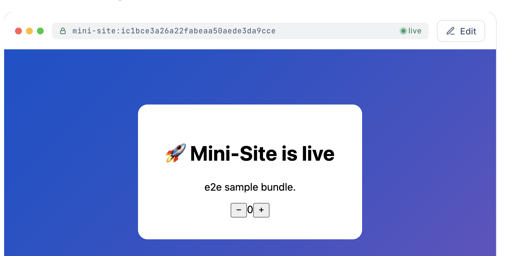

# Mini Site for Confluence — Documentation

Embed a **live, multi-file mini-site** — a clickable prototype, an interactive dashboard, or a small
internal tool — directly on a Confluence page. Not a screenshot, not a link out: the real thing, running
inline, for anyone who can view the page.

- **App name:** Mini Site for Confluence
- **App key:** `com.zenuml.confluence.minisite`
- **Platform:** Atlassian Forge · Confluence Cloud
- **Support:** support@zenuml.com

---

## 1. How the app works

You build a static bundle (`index.html` plus its CSS, JS and assets) with any tool you like — a design-tool
export, an AI-generated prototype, a hand-written dashboard. You drag that folder into the Mini-Site macro
on a Confluence page. The app validates it, provisions it to an isolated sandbox, and renders it inline on
the page.

```
Confluence page
  └─ Mini-Site macro (Custom UI)
        │  1. You upload a folder of static files
        ▼
     Validation + security scan   ── rejects unsafe or oversized bundles
        │  2. Provisioned to an isolated per-macro sandbox
        ▼
     Live render, inline on the page (interactive, for anyone who can view the page)
```

Three things worth knowing:

**Each macro instance is isolated.** Every Mini-Site macro gets its own sandbox. One page's bundle cannot
read or reach another's.

**Permissions are inherited from Confluence.** The app adds no permission model of its own. If a person can
view the page, they can see the mini-site; if they cannot, they cannot. Nothing is publicly addressable —
the sandboxes have no public URL, and each render is authorised individually and expires.

**Bundle bytes are hosted outside Atlassian.** The app is a Forge app, but the static files you upload are
stored and served from Cloudflare infrastructure operated by us. This is disclosed on the listing's
Privacy & Security tab. No Confluence page content and no personal data is sent there — only the bundle you
upload and the identifiers needed to serve it back to the right macro.

---

## 2. See it in action

The screenshots below show the two steps a reviewer needs to confirm: the bundle is uploaded as a folder, then rendered live and interactively inline on the Confluence page.



*Live render: the bundle runs inline inside the page, with its own live status and interactive controls.*


*Publisher: upload a folder containing `index.html` and its relative CSS, JavaScript, and image assets.*

## 3. Key features

| Feature | What it does |
|---|---|
| **Mini-Site macro** | Insert on any page. Renders your bundle live and interactive, inline. |
| **Drag-and-drop publisher** | Drop a whole folder. Nested paths and relative `fetch()` / `src` references are preserved exactly as built. |
| **Multi-file bundles** | Real projects, not single files: HTML + CSS + JS + images + data files. |
| **Validation + secret scan** | Every upload is checked server-side before it can ever be served. |
| **Inherited permissions** | Access follows Confluence page permissions. No separate sharing model to manage. |
| **Isolated sandboxes** | One non-routable sandbox per macro instance. |
| **No scopes requested** | The app requests no Confluence permission scopes and reads no page content. |

### Limits

| | |
|---|---|
| Files per bundle | 2,000 |
| Per file | 25 MiB |
| Per bundle (total) | 50 MiB |
| Content | Static only — HTML/CSS/JS. No server-side runtime inside the bundle. |
| Required | An `index.html` at the root of the folder. |
| Paths | Relative only. Absolute paths and `../` traversal are rejected. |

---

## 4. Setup

**Prerequisites:** a Confluence Cloud site, and site-admin rights to install the app.

1. Install **Mini Site for Confluence** from the Atlassian Marketplace onto your Confluence Cloud site.
2. That's it — there is nothing to configure. No API keys, no accounts to create, no external service to
   sign up for. The app is ready as soon as it is installed.

The app is paid via Atlassian and includes a free trial. While a licence is active you can publish new
mini-sites and view existing ones. **If a licence lapses, already-published mini-sites keep rendering for
viewers** — only publishing new bundles is blocked, so a lapsed licence never breaks a live page.

---

## 5. Usage

### Download a ready-to-upload sample

To try the app without creating files first, download the [sample mini-site bundle](https://raw.githubusercontent.com/ZenUml/conf-mini-sites/master/docs/listing/demo-bundle.zip), unzip it, and upload the resulting `demo-bundle` folder. It contains a multi-file interactive dashboard (`index.html`, `style.css`, and `app.js`).

### Publish a mini-site

1. Edit any Confluence page.
2. Type `/Mini-Site` (or choose **Mini-Site** in the macro browser) and insert the macro.
3. The macro shows an empty launcher. Click **Upload** to open the publisher.
4. Drag in the downloaded sample folder, or your own **folder** of static files containing `index.html`.
5. Click **Publish**. The bundle is validated, scanned, and provisioned.
6. Publish the page. The mini-site now renders live for anyone who can view that page.

Each Mini-Site macro is independent: a page can carry several, and each holds its own bundle.

---

## 6. Testing — how to verify the app works

This section is a complete verification script. It takes about two minutes and needs no external tools or
accounts.

### Step 1 — Create a test bundle

Create a folder called `mini-site-test` with these three files.

`index.html`
```html
<!doctype html>
<html lang="en">
<head>
  <meta charset="utf-8" />
  <title>Mini-Site test</title>
  <link rel="stylesheet" href="style.css" />
</head>
<body>
  <main>
    <h1>🚀 Mini-Site is live</h1>
    <p>If you can click the button and the number changes, the app works.</p>
    <button id="btn">Clicked <span id="n">0</span> times</button>
  </main>
  <script src="app.js"></script>
</body>
</html>
```

`style.css`
```css
body { font-family: system-ui, sans-serif; display: grid; place-items: center; min-height: 90vh; margin: 0;
       background: linear-gradient(135deg, #2563eb, #7c3aed); }
main { background: #fff; padding: 2rem 3rem; border-radius: 12px; text-align: center; }
button { font-size: 1rem; padding: .6rem 1.2rem; border: 0; border-radius: 6px;
         background: #2563eb; color: #fff; cursor: pointer; }
```

`app.js`
```js
let n = 0;
document.getElementById('btn').addEventListener('click', () => {
  document.getElementById('n').textContent = ++n;
});
```

These three files prove the two things that matter: it is **multi-file** (the CSS and JS load via relative
paths), and it is **live** (the JS runs and responds to clicks).

### Step 2 — Publish it

1. Create a new Confluence page.
2. Insert the **Mini-Site** macro (`/Mini-Site`).
3. Click **Upload**, drag in the whole `mini-site-test` folder, click **Publish**.
4. Publish the page.

**Expected:** the publisher lists all three files, reports validation passing, and finishes on a preview of
the live mini-site.

### Step 3 — Verify the live render

Look at the published page.

**Expected:**
- The mini-site renders inline — a purple gradient card reading "🚀 Mini-Site is live".
- `style.css` has applied (the gradient and card styling are present). This proves relative-path assets resolve.
- Clicking the button increments the counter. This proves the bundle is **live and interactive**, not a screenshot.

### Step 4 — Verify permission inheritance

1. Restrict the test page (**⋯ → Restrictions**) so that another user cannot view it.
2. Open the page as that user.

**Expected:** they cannot see the page, and cannot see the mini-site. The mini-site is not reachable
independently of the page — sandboxes have no public URL, and each render is individually authorised and
short-lived.

### Step 5 — Verify validation rejects a bad bundle

Try publishing a folder with **no `index.html`** at its root.

**Expected:** the publish is rejected with a clear error, and nothing is provisioned. Every bundle must pass
validation — structure, path safety, size caps and a credential scan — before it can ever be served.

---

## 7. Troubleshooting

| Symptom | Cause / fix |
|---|---|
| "No index.html" on publish | The folder must contain `index.html` **at its root**, not nested in a subfolder. Drag the folder that *contains* `index.html`. |
| Assets (CSS/images) don't load | Use **relative** paths (`style.css`, `./img/logo.png`). Absolute paths (`/style.css`) are rejected. |
| Bundle rejected as too large | Limits are 2,000 files, 25 MiB per file, 50 MiB per bundle. |
| Publish blocked, viewing still works | The licence is inactive. Renew to publish again; existing mini-sites keep rendering. |
| External fonts/CDN/API calls don't load | Bundles are sandboxed and blocked from calling third-party origins. Bundle your assets locally. |
| Macro shows the upload panel instead of a site | Nothing has been published to that macro instance yet. |

---

## 8. Privacy & security

- Access is inherited from Confluence page permissions; the app runs no permission model of its own.
- Each macro instance is served from its own non-routable sandbox with no public URL.
- Every serve is individually authorised and short-lived; failures fail closed.
- Every upload is validated (structure, path traversal, size caps) and scanned for credentials before it can
  be served. The scan is a best-effort safety net, not a guarantee — do not put secrets in a bundle.
- Served content is sandboxed by Content-Security-Policy and cannot call out to third-party origins.
- Uploaded bundle bytes are hosted on Cloudflare infrastructure operated by us. No Confluence page content
  and no personal data is sent there.

Full detail is on the listing's Privacy & Security tab.

---

## 9. Support

**support@zenuml.com** — questions, issues, or bug reports.
