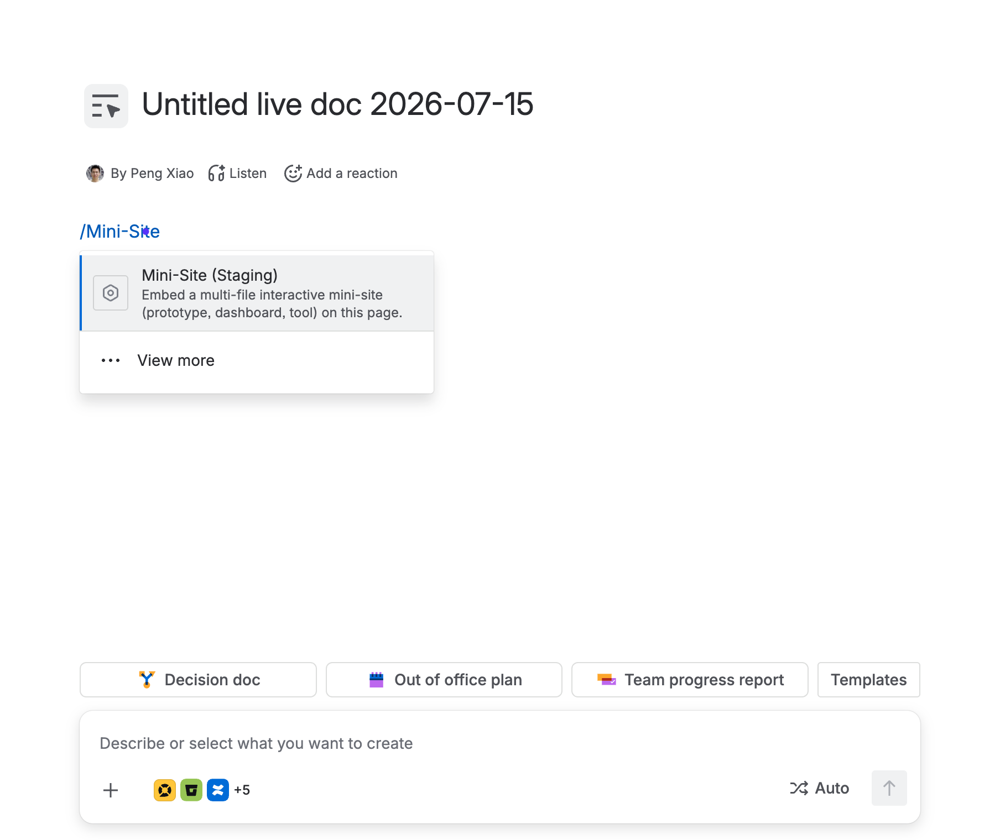
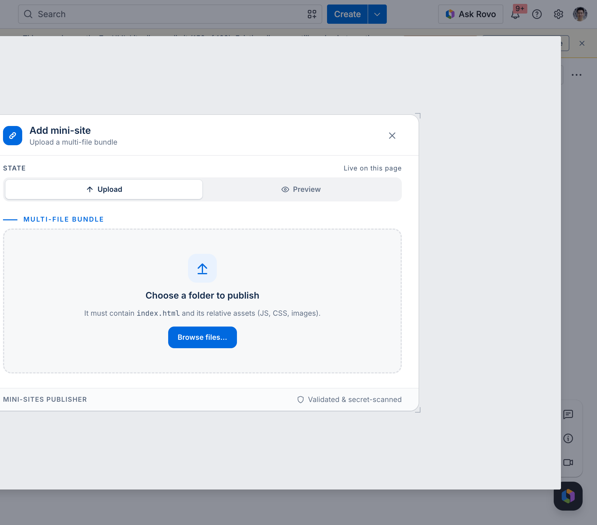
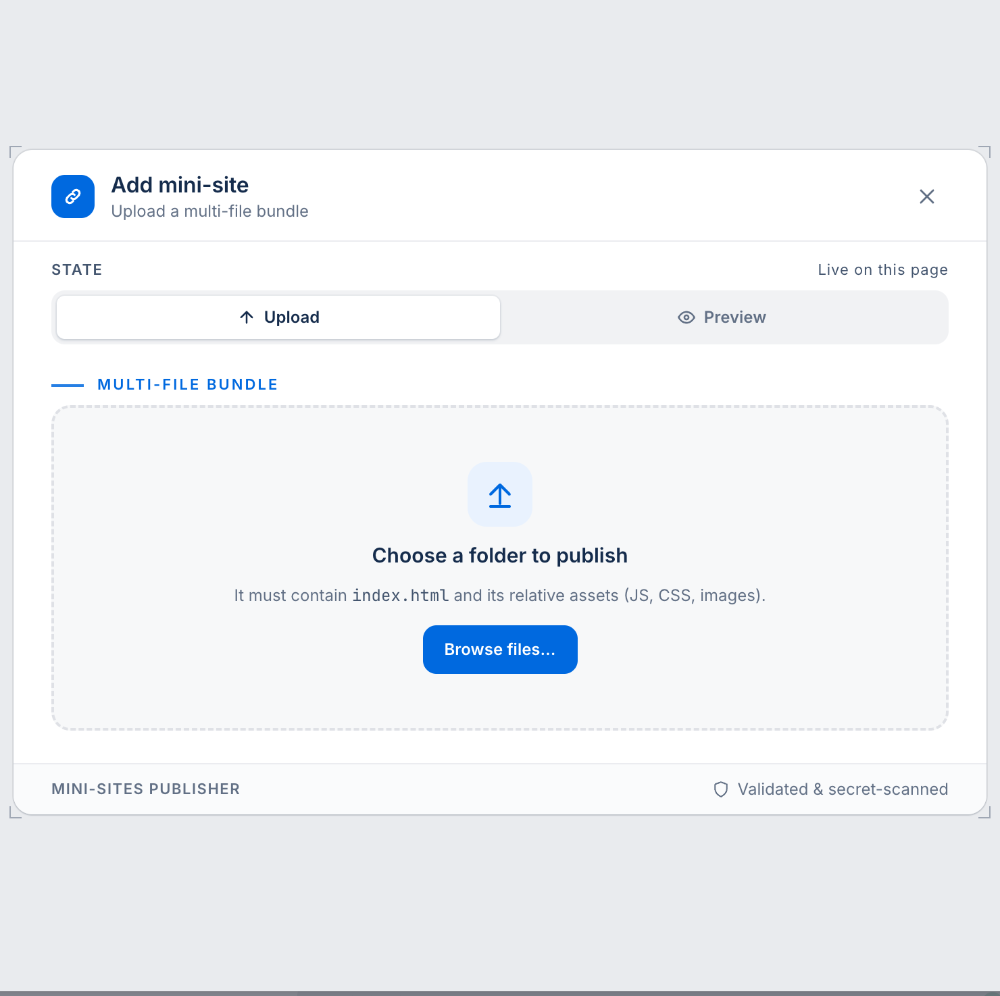
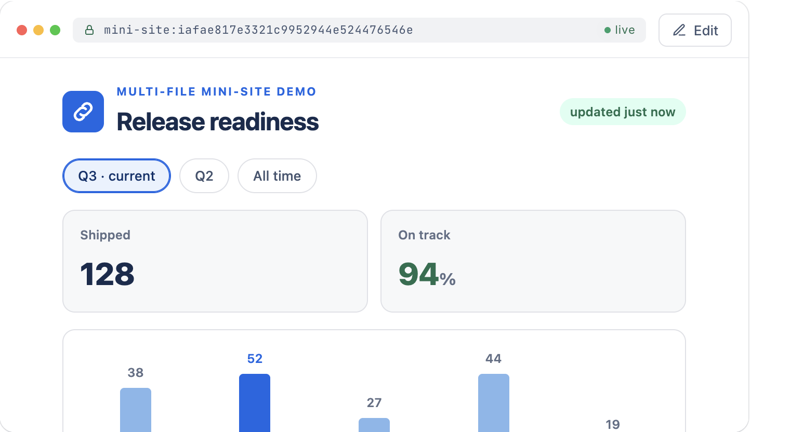

# Mini Site for Confluence — Documentation

Mini Site lets you upload a folder of HTML, CSS, JavaScript, and image files and run it live inside a
Confluence page.

**Support:** support@zenuml.com

## Reviewer quick start

Follow these steps in order. You do not need to create a sample project: use the downloadable sample.

### Step 1 — Download the sample

Download the [sample mini-site bundle](https://raw.githubusercontent.com/ZenUml/conf-mini-sites/master/docs/listing/demo-bundle.zip).

### Step 2 — Unzip the sample

Unzip `demo-bundle.zip` on your computer. You should now have a folder called `demo-bundle`.

Inside that folder are:

```text
demo-bundle/
├── index.html
├── style.css
└── app.js
```

Keep the folder structure unchanged.

*The sample contains `index.html` plus its relative CSS and JavaScript files.*

### Step 3 — Edit a Confluence page

Open Confluence and edit any page, or create a new page.

*Start from the normal Confluence page editor.*

### Step 4 — Insert the Mini-Site macro

Type `/Mini-Site` and select **Mini-Site** from the macro browser.

The macro will appear on the page with an upload panel.



*The page editor is ready for the Mini-Site macro.*

### Step 5 — Open the folder picker

Click **Upload**, then click **Browse files…**.



*The publisher asks for a folder containing `index.html`.*

### Step 6 — Select the unzipped folder

Select the unzipped `demo-bundle` folder — select the folder itself, not one of the files inside it.

If you use a different folder, make sure it contains an `index.html` file at the **top level** of the
folder. The app does not accept a folder where `index.html` is hidden inside another nested folder.

*Select the unzipped folder itself. The operating-system folder picker is not part of the Confluence page.*

### Step 7 — Publish the mini-site

Wait for the files to appear in the upload panel. Confirm that `index.html`, `style.css`, and `app.js` are
listed, then click **Publish**.

The app validates the folder, checks it for accidentally included credentials, and provisions it in an
isolated sandbox.



*Use this publisher panel to confirm the folder requirement before publishing.*

### Step 8 — Publish the Confluence page

Click **Publish** in Confluence to save the page.


*Save the page after the mini-site upload has completed.*

### Step 9 — Test the live mini-site

Open the published page. The sample should render inline as an interactive dashboard.



*The uploaded bundle runs live inside the Confluence page.*

Confirm these two results:

1. The page shows the sample interface, including its styling. This proves that `style.css` loaded.
2. Interact with the sample controls. This proves that `app.js` loaded and the site is live, rather than a
   screenshot or static preview.

### If you use your own folder

Your folder must contain a root-level `index.html`. CSS, JavaScript, images, and other files may be included
as needed, but references must use relative paths, for example:

```html
<link rel="stylesheet" href="style.css">
<script src="app.js"></script>

```

The upload is static only. Server-side code is not executed inside the bundle.

## What the app demonstrates

- **Multi-file bundles:** HTML, CSS, JavaScript, images, and data files can be uploaded together.
- **Live rendering:** the bundle runs interactively inside the Confluence page.
- **Folder upload:** nested relative paths are preserved.
- **Independent instances:** each Mini-Site macro has its own isolated sandbox.
- **Confluence permissions:** access follows the page. Anyone who can view the page can view its mini-site.
- **No Atlassian API scopes:** the app requests no Confluence permission scopes.

## Limits

| Limit | Value |
|---|---:|
| Files per bundle | 2,000 |
| Maximum file size | 25 MiB |
| Maximum bundle size | 50 MiB |
| Required file | `index.html` at the folder root |

Absolute paths and `../` path traversal are rejected. External fonts, CDNs, and API calls are not available
from the sandbox; bundle required assets locally.

## Troubleshooting

| Problem | Fix |
|---|---|
| `index.html` is not found | Select the folder that directly contains `index.html`, not its parent folder or a nested subfolder. |
| CSS or JavaScript does not load | Use relative paths such as `style.css` and `app.js`. |
| The upload is rejected as too large | Stay within the limits above. |
| The upload panel remains visible | The bundle has not been published for this macro instance yet. |
| Viewing works but publishing is blocked | The Atlassian licence is inactive; renew it to publish new bundles. Existing published mini-sites continue to render. |

## Privacy and security

- The app adds no separate sharing model; access follows Confluence page permissions.
- Each macro instance is served from an isolated, non-routable sandbox with no public URL.
- Uploaded files are validated and scanned for credentials before serving.
- The bundle is served from Cloudflare infrastructure operated by us. No Confluence page content or personal
  data is sent there; only the uploaded bundle and identifiers needed to serve it.
- Served content is sandboxed and cannot call third-party origins.

Full detail is available on the listing's **Privacy & Security** tab.

## Support

**support@zenuml.com** — questions, issues, or bug reports.
