# Technical Spike RFC: Agent-First Product Demo Video Pipeline

**Status:** Phase 1 PoC complete and proven (2026-07-21) — see `demo-pipeline/README.md`'s "Phase 1
evidence" section for the real three-run proof, acceptance-criteria checklist, and the aidemo
benchmark decision (deferred; see below). Original research/recommendation below is unchanged.  
**Date:** 2026-07-19  
**Scope:** Ecosystem validation, architecture, gaps, risks, and smallest executable proof of concept  
**Non-goal:** Building a screen recorder, a nonlinear editor, or the full production system

## Executive decision

Build the **Director and canonical contracts**, not another recorder or editor.

The recommended foundation is a replaceable, local-first pipeline:

1. A Director creates an evidence-backed `StorySpec` and compiles it into a deterministic `DemoPlan`.
2. The existing Playwright 1.61 workflow executes the plan and uses Playwright Screencast as the default browser capture engine.
3. An action/event timeline drives narration, captions, and edit decisions.
4. Kokoro supplies local English narration for the first PoC; CosyVoice is the first local Mandarin candidate. Captions initially use the known script and measured audio durations.
5. FFmpeg executes a declarative edit decision list for the proof of concept.
6. `aidemo`, Highlight Studio, and OBS remain optional adapters, never canonical data models.

`aidemo` is the closest verified match to the end-to-end vision: it already exposes a CLI and MCP server for storyboard validation, browser execution, voice, capture, captions, zoom/cursor treatment, composition, rendering, job status, and cancellation. However, it was created on 2026-07-06, currently has one human maintainer, and its CI does not execute its included MCP smoke test. It is the best **integration candidate and reference implementation**, but not yet a safe unwrapped architectural core. Pin it and benchmark it behind an adapter before depending on it.

The product differentiation remains the Director: product understanding, evidence collection, story discovery, claim verification, selection among story candidates, compilation into reproducible demonstrations, and outcome-based quality evaluation.

## Evidence notation and research limits

- **[V] Verified:** confirmed from an official repository, official documentation, source code, license, or this repository.
- **[I] Inferred:** architectural conclusion derived from verified facts; it still needs runtime validation.
- **[U] Unverified:** marketing claim, missing public evidence, or capability not found in the official material reviewed.

Research used official sources as of 2026-07-19. Repository activity timestamps were checked through the GitHub API. This was a **static ecosystem investigation**: no candidate was installed or executed, so output quality, performance, unattended macOS permission behavior, and real-world stability remain runtime proof-of-concept questions.

## Local product baseline

The current repository already contains a valuable Demo Agent foundation:

- **[V]** It pins `@playwright/test` `^1.61.0` in [`package.json`](../../package.json).
- **[V]** The UI project runs with a saved authenticated Chrome state, a single worker, and one retry in CI. The configuration enables trace only on the first retry and does not enable video capture in [`playwright.config.ts`](../../playwright.config.ts).
- **[V]** The real workflow creates a Confluence macro page, opens the nested Forge UI, selects a bundle, publishes it, opens the live preview, and asserts that the dispatched mini-site is live in [`full-flow.spec.ts`](../../tests/e2e/ui/full-flow.spec.ts).
- **[V]** The helpers already solve two hard automation problems: discovery of cross-origin/nested Forge frames and file/folder upload through `setInputFiles`, avoiding the native picker in [`forge.ts`](../../tests/e2e/helpers/forge.ts).

**[I]** The lowest-risk proof of concept should reuse this workflow instead of translating it into a less capable generic action vocabulary. The missing layer is not browser control; it is a semantic shot plan, timed event/cursor metadata, bounded recording, narration, composition, and artifact manifests.

## 1. Ecosystem report

### 1.1 End-to-end, demo, and capture candidates

| Project | Verified architecture and automation | License and activity | Local / agent fit | Recommendation |
|---|---|---|---|---|
| **aidemo** | **[V]** TypeScript CLI + stdio MCP; declarative Zod storyboard; Playwright/native/OBS capture choices; voice, captions, zoom, cursor, cards, FFmpeg compose/render; async MCP jobs expose progress/status/cancel. See the [official repository](https://github.com/tandryukha/aidemo), [action schema](https://github.com/tandryukha/aidemo/blob/main/src/types.ts), and [MCP server](https://github.com/tandryukha/aidemo/blob/main/src/mcp/server.ts). | **[V]** MIT; created 2026-07-06; pushed 2026-07-18; releases exist, but the contributor list currently shows one human maintainer plus Dependabot. The [CI workflow](https://github.com/tandryukha/aidemo/blob/main/.github/workflows/ci.yml) typechecks and scans, but does not run the included [MCP smoke test](https://github.com/tandryukha/aidemo/blob/main/test/mcp-smoke.mjs). | **[V]** Strongest agent interface; local/offline is supported except optional cloud TTS. **[I]** High feature fit, low maturity. | **Provisional adapter/reference.** Pin an immutable release; do not adopt its storyboard as the Director's public contract. |
| **OpenCap** | **[V]** The agent-oriented product documents CLI + MCP, macOS ScreenCaptureKit window capture, event JSONL, `record start/stop`, trimming, and upload/share operations in its [official docs](https://opencap.dev/docs/getting-started). | **[V]** Official site labels it pre-launch v0.1 and macOS-only. **[U]** No public source repository or open-source license was located. Sign-in and cloud sharing are part of the documented flow. | **[I]** Scriptable capture, but platform, account, cloud, and pre-launch dependencies conflict with the default local-first path. It does not supply product understanding or a complete editor. | **Do not make core.** Re-evaluate as a macOS capture adapter after GA and license/API clarification. Do not confuse it with the unrelated Apache-licensed [Stanford biomechanics OpenCap](https://github.com/opencap-org/opencap-core), or the discontinued [OpenKap](https://openkap.com/). |
| **Highlight Studio** | **[V]** A native macOS editor exposes a localhost TCP JSON command server. Documented commands include record start/stop, split, zoom, annotation, subtitle generation, project operations, and export. See the [command server](https://highlightstudio.app/help/cli-ai-automation/cli-command-server) and [agent integration guide](https://highlightstudio.app/help/cli-ai-automation/ai-agent-integration). | **[U]** No public source license was located; it is distributed as a commercial/native app. **[U]** Headless CI operation and server authentication are not documented in the pages reviewed. | **[V]** Programmatic after the app is installed and running. **[I]** Good potential quality adapter, but macOS/runtime-GUI coupling and licensing reduce reproducibility and portability. | **Optional “pro” compositor benchmark**, not the default. Validate unattended launch, permissions, API stability, security, and licensing first. |
| **Screen Studio** | **[V]** Offers polished automatic zoom, cursor smoothing, cuts, subtitles, and export in a macOS desktop editor, documented on its [official site](https://screen.studio/). | **[V]** Commercial macOS software governed by its [legal terms](https://screen.studio/legal). **[U]** No official CLI, API, SDK, or MCP interface was found in the material reviewed. | **[I]** Strong visual benchmark, but fails the agent-first core requirement because repeated editing/export is GUI-oriented. | **Exclude from core.** Keep only as a human quality reference or optional fallback. |
| **OpenDemo** | **[V]** MIT project combining a JSON-driven Playwright runner with inherited Electron/React editor/export code. Its [usage guide](https://github.com/yasirwhite/OpenDemo/blob/main/USAGE.md) exposes only `goto`, `click`, `type`, `scroll`, and `wait`, plus zoom configuration; the [agent guide](https://github.com/yasirwhite/OpenDemo/blob/main/AGENT_README.md) says web-only. | **[V]** Created 2026-06-22; pushed 2026-07-02; 3 stars/1 fork at review time; MIT. | **[V]** JSON scriptable and local. **[I]** Its action set cannot represent this product's nested-frame scoping, directory upload, keyboard/hover operations, or semantic assertions without modification; the Electron/UI coupling is heavier than needed. | **Reference only.** Do not select as foundation without a substantially stronger action/plugin contract and maintenance evidence. |
| **OpenScreen** | **[V]** Cross-platform GUI recorder/editor and the codebase from which OpenDemo was derived. See the [official repository](https://github.com/siddharthvaddem/openscreen). | **[V]** MIT, about 39.5k stars at review time, but the repository is archived. | **[I]** Large visual-editor surface, no native agent contract, and no future maintenance path. | **Exclude from core.** Useful only for source/design archaeology. |
| **Playwright 1.61** | **[V]** Fully programmatic browser automation. The current [Screencast API](https://playwright.dev/docs/api/class-screencast) provides precise start/stop, WebM output or JPEG frames with timestamps, action overlays, chapters, and animated pointer decoration. Standard [video recording](https://playwright.dev/docs/videos), [tracing](https://playwright.dev/docs/api/class-tracing), and an official [MCP server](https://playwright.dev/docs/getting-started-mcp) also exist. | **[V]** Apache-2.0 project; actively maintained. This repo already uses 1.61. | **[V]** Local, cross-platform, scriptable, deterministic enough for fixed browser workflows. **[I]** Screencast captures the page viewport, not native file pickers, browser chrome, or arbitrary desktop apps. | **Default DemoRunner + browser CaptureEngine.** Use deterministic Playwright code in capture; reserve MCP/LLM control for discovery and rehearsal authoring. |
| **OBS Studio + obs-websocket** | **[V]** OBS accepts [launch parameters](https://obsproject.com/kb/launch-parameters), including recording startup, profiles, and scenes. [obs-websocket](https://github.com/obsproject/obs-websocket) is bundled with OBS 28+ and exposes programmatic control. | **[V]** GPL-2.0; mature and active. | **[V]** Local and scriptable, but a GUI application/process and OS capture permissions still exist; it is not a clean headless browser primitive. | **Optional native/whole-screen capture adapter** when page-only capture is insufficient. |
| **Cap** | **[V]** Active Loom-like open-source recorder/sharing product; most code is under AGPLv3, with selected camera/capture crates under MIT in its [license](https://github.com/CapSoftware/Cap/blob/main/LICENSE). | **[V]** Active, about 20k stars at review time. | **[I]** Strong recorder/product, but its GUI, sharing backend, and license surface do not solve the Director or provide a minimal autonomous compositor contract. | **Do not adopt as core.** Consider only if a reusable MIT capture crate fills a concrete future gap. |
| **Kap** | **[V]** macOS Electron screen recorder with plugins; [MIT repository](https://github.com/wulkano/Kap). | **[V]** Last repository push observed 2024-11-12. | **[I]** GUI-first and weak current activity for a new foundation. | **Exclude from core.** |

### 1.2 Editing, voice, and subtitle primitives

| Project | Verified facts | Fit and caveat | Recommendation |
|---|---|---|---|
| **FFmpeg** | **[V]** Non-interactive CLI with filter graphs for trim/concat, crop/scale, overlay, subtitles, audio mixing, normalization, and encoding in the [filter documentation](https://ffmpeg.org/ffmpeg-filters.html). FFmpeg is primarily LGPL 2.1+, but optional build flags and components can make a binary GPL or nonfree; see [FFmpeg Legal](https://ffmpeg.org/legal.html). | **[I]** Best reproducible execution engine, but not a high-level product-demo authoring model. Codec and binary configuration must be recorded and legally reviewed. | **Default rendering primitive behind `Compositor v1`.** Feed it an EDL; do not expose raw filter graphs to the Director. |
| **Remotion** | **[V]** Active React/TypeScript programmatic video framework with CLI/render APIs. Its [official license](https://github.com/remotion-dev/remotion/blob/main/LICENSE.md) is source-available with business-size conditions, not a simple permissive OSS license. | **[I]** Excellent motion-design ergonomics, but licensing and framework coupling create a meaningful dependency. | **Optional compositor adapter** only after commercial-license review; not required for the proof of concept. |
| **Kokoro-82M** | **[V]** Local 82M-parameter TTS model; the [model card](https://huggingface.co/hexgrad/Kokoro-82M) and [reference repository](https://github.com/hexgrad/kokoro) use Apache-2.0. Its [official voice table](https://huggingface.co/hexgrad/Kokoro-82M/blob/main/VOICES.md) lists Mandarin voices but grades them D and warns that non-English language support may be thin. | **[I]** Strong English local-first default, but “supports Mandarin” is not evidence of production-quality Mandarin. Exact model/voice revisions require runtime evaluation and pinning. | **Default English `VoiceProvider` for the PoC.** Cache generated WAV files by script/model/voice hash. |
| **CosyVoice** | **[V]** The active [FunAudioLLM/CosyVoice repository](https://github.com/FunAudioLLM/CosyVoice) exposes local inference, training, deployment, APIs, Chinese/English and wider multilingual synthesis; repository code is [Apache-2.0](https://github.com/FunAudioLLM/CosyVoice/blob/main/LICENSE). | **[I]** Better-aligned candidate for Mandarin quality, but heavier than Kokoro. **[U]** The exact selected checkpoint's license, hardware needs, latency, preset-voice rights, and quality have not been validated. Voice cloning adds consent/impersonation risk and is not needed here. | **First Mandarin `VoiceProvider` candidate.** Permit preset voices only until checkpoint/license/consent review passes. |
| **Fish Speech** | **[V]** Active multilingual local TTS with an API/server, but its current [Fish Audio Research License](https://github.com/fishaudio/fish-speech/blob/main/LICENSE) requires a separate license for any commercial use, including internal business operations. | **[I]** Technically capable but incompatible with an unencumbered commercial default. | **Exclude from default.** It may be evaluated only under a separate commercial agreement. |
| **Piper** | **[V]** Active local CLI/API TTS in [OHF-Voice/piper1-gpl](https://github.com/OHF-Voice/piper1-gpl), licensed GPL-3.0. | **[I]** Technically agent-friendly, but copyleft obligations are less convenient for product distribution. | **Fallback local adapter**, subject to legal review. |
| **Whisper** | **[V]** Local MIT speech-recognition model/code in the [official OpenAI repository](https://github.com/openai/whisper). | **[I]** Useful for externally recorded human narration, but transcribing our own known generated script adds nondeterminism and compute. | **Optional QA/transcription adapter**, not the initial caption timing source. |
| **WhisperX** | **[V]** BSD-2-Clause project for timestamped transcription and word alignment in the [official repository](https://github.com/m-bain/whisperX). | **[I]** Adds PyTorch/alignment-model/GPU complexity and has more moving parts than needed for scene-level captions. | **Later word-level alignment adapter** if script-based timing is visibly insufficient. |
| **OpenAI TTS** | **[V]** Hosted `tts-1-hd` remains documented as a quality-optimized TTS model on the [official model page](https://developers.openai.com/api/docs/models/tts-1-hd). | **[I]** Convenient quality option, but introduces cost, credentials, network failure, provider drift, and less reproducible audio. | **Optional cloud `VoiceProvider`; never required for local rendering.** Revalidate current model status before implementation. |

### 1.3 Overall comparison

The following ratings are architectural assessments, not vendor claims.

| Candidate | Native agent interface | Unattended core path | Local-first | Replaceable integration | Maturity confidence | Core disposition |
|---|---:|---:|---:|---:|---:|---|
| Playwright Screencast | High | High | High | High | High | **Default execution/capture** |
| FFmpeg | High | High | High | High | High | **Default compositor primitive** |
| aidemo | High | High | High | Medium | Low | **Pinned provisional adapter** |
| OBS + websocket | High | Medium | High | High | High | Optional native capture |
| Highlight Studio | High | Medium | High | Medium | Medium/unknown | Optional quality adapter |
| OpenCap | High | Unknown | Low/medium | Medium | Low/pre-launch | Watchlist |
| OpenDemo | Medium/high | Medium | High | Low/medium | Low | Reference only |
| Screen Studio | Low/not documented | Low | High | Low | High as GUI product | Benchmark/fallback only |
| OpenScreen | Low | Low | High | Low | Archived | Exclude |
| Cap / Kap | Low/partial | Low | Medium/high | Low/medium | Mixed | Exclude from core |

### 1.4 Adjacent research: Rhetor

**[V]** The June 2026 paper [“Rehearsed Multi-Agent Live Product Demonstrations with Real-Time Voice Question Answering”](https://arxiv.org/abs/2606.30294) describes **Rhetor**, a system that combines source-code analysis and UI exploration, ranks features, grounds scripts in UI elements observed during exploration, rehearses with locator repair and graceful degradation, and synchronizes each browser action with narration audio. It reports six pipeline sessions across four deployed applications and proposes a ten-metric benchmark protocol.

**[U]** No public implementation repository or license was located from the paper/search material reviewed, and the reported evidence is a small case study rather than an independently reproduced benchmark. Rhetor is therefore not a reusable software dependency today.

**[I]** Four Rhetor ideas should be adopted as architecture requirements: merge source evidence with UI observation; forbid the scripter from inventing unobserved controls; rehearse until explicit convergence/failure; and define action/narration synchronization as a runtime invariant. Its locator-firing and rehearsal metrics are useful starting points for our evaluation suite.

## 2. Proposed architecture

The full diagram and contract table are in [the architecture companion](./2026-07-19-agent-first-video-pipeline-architecture.md).

```mermaid
flowchart LR
    product["Product version + objective"] --> evidence["Evidence Collector"]
    evidence -->|"ProductSnapshot"| director["Story Director"]
    director -->|"StorySpec"| critic["Evidence + Story Critic"]
    critic -->|"approved story"| compiler["Demo Compiler"]
    compiler -->|"DemoPlan"| runner["DemoRunner adapter"]
    runner --> capture["CaptureEngine adapter"]
    capture --> artifacts["Video + ActionEvent timeline"]
    critic --> voice["VoiceProvider adapter"]
    voice --> artifacts
    artifacts --> captions["Caption timing"]
    captions --> edl["EditDecisionList"]
    edl --> compositor["Compositor adapter"]
    compositor --> output["Final media + RenderManifest"]
```



### Why the intelligence belongs before capture

The Director should answer:

- Which product change matters to this audience?
- What user problem and outcome should the video show?
- Which claims are supported by product evidence?
- Which state and fixture make the value visible?
- Which actions prove the claim instead of merely navigating the UI?
- What should be omitted to keep the narrative coherent?

The media pipeline should answer only:

- How to execute an already-approved plan reliably.
- How to record action timing and visuals.
- How to turn declarative edit decisions into media files.

**[I]** This separation is the primary defense against building an editor disguised as an agent. It also lets the team replace Playwright, FFmpeg, TTS, or a premium compositor without retraining or rewriting the Director.

### Reproducibility model

“Nearly identical” should mean stable story, scene order, state transitions, text, narration artifacts, camera intent, and bounded timing—not necessarily byte-identical encoded video.

Each run must record:

- product Git SHA/build identifier and target environment;
- fixture/reset identifier and hashes of input bundles;
- browser, Playwright, OS/container, font, viewport, color-profile, locale, and timezone versions;
- `StorySpec`, `DemoPlan`, EDL, model ID/revision, voice ID, random seeds, and generated-audio hashes;
- capture/compositor binary versions and FFmpeg configure flags;
- every input/output hash, warning, assertion result, and redaction decision.

Discovery may be stochastic. Once a `StorySpec` is approved, rehearsal, capture, and rendering must be deterministic and restartable from manifests. Local TTS output should be cached so a rerender does not change narration.

## 3. Recommended stack

| Layer | Default | Rationale | Replaceable alternatives |
|---|---|---|---|
| Orchestration | TypeScript CLI + MCP job facade | Matches the repository; easy JSON Schema validation; agent can start/status/cancel without a GUI | HTTP job API, Python CLI |
| Contracts | Versioned JSON Schema/Zod | Typed, inspectable, language-neutral artifacts | Protobuf after scale requires it |
| Product evidence | Repository/release/docs/browser collectors | Keeps claims grounded and attributable | Connectors for issue trackers, analytics, design docs |
| Story intelligence | Provider-neutral LLM adapter + deterministic critic rules | The Director is the differentiation; avoid model lock-in | Local or hosted models |
| Demo execution | Existing Playwright 1.61 helpers | Already proves the real Confluence workflow and avoids native pickers | Playwright MCP during discovery; native adapter later |
| Browser capture | Playwright `page.screencast` | Precise, programmatic, already compatible with the pinned version; supports pointer/action decoration | OBS for whole-screen/native capture |
| Timeline | Append-only JSONL + local content-addressed artifacts | Inspectable, replayable, easy to debug | SQLite/object storage later |
| Voice | Kokoro-82M for English PoC; CosyVoice evaluation for Mandarin | Local and scriptable; avoids treating weak multilingual support as production quality | OpenAI TTS or another cloud provider |
| Caption timing | Script segments + measured audio duration | The text is already known; avoids self-transcription | WhisperX for word alignment |
| Composition | EDL compiler + FFmpeg process | Mature unattended primitive; keeps edit decisions declarative | aidemo, Highlight Studio, Remotion adapters |
| QA | Playwright assertions + ffprobe/media checks + story-evidence checks | Verifies both product outcome and media validity | Visual/audio quality models later |

### Why aidemo is not the canonical core—yet

**Reuse it where it is strong:** authoring schema ideas, MCP job semantics, zoom/cursor/caption composition, and possibly its renderer after a runtime benchmark.

**Do not couple to it where it is weak:** project maturity, one-maintainer bus factor, unexecuted smoke test in CI, and product-specific action gaps. The existing Confluence flow requires frame discovery, directory upload, retries around Forge timing, and outcome assertions. A generic `click/type/wait` storyboard is not sufficient.

The recommended seam is:

```text
Director contracts -> MediaPipelineAdapter
                     |- Native Playwright + FFmpeg (default/PoC)
                     |- aidemo adapter (experimental)
                     |- Highlight Studio adapter (optional commercial)
```

## 4. Gap analysis

### What already exists and should be reused

| Capability | State |
|---|---|
| Browser automation and authenticated product workflow | Strong: existing Playwright helpers and tests |
| Browser-native capture | Strong: Playwright Screencast/video |
| Whole-screen/native capture | Strong primitives: OBS; optional commercial tools |
| Codecs, muxing, trimming, overlays, audio processing | Strong: FFmpeg |
| Local and hosted narration | Strong: Kokoro/Piper and cloud providers |
| Transcription/alignment | Strong: Whisper/WhisperX |
| Programmatic product-demo rendering | Exists but immature: aidemo/OpenDemo; commercial Highlight option |
| Agent job protocol | Exists as a pattern: MCP/CLI jobs in aidemo and other tools |

### What must be built

1. **Product Evidence Collector:** merges traceable source/release evidence with observed UI state to produce product capabilities, audience facts, and safe demo fixtures.
2. **Story Director:** generates and ranks multiple candidate stories by audience relevance, proof strength, novelty, and demo feasibility.
3. **Evidence/claim gate:** refuses unsupported marketing claims and maps every scene promise to observable product evidence.
4. **Canonical contracts:** versioned `StorySpec`, `DemoPlan`, `ActionEvent`, `CaptureManifest`, narration, EDL, and render schemas independent of vendors.
5. **Demo compiler:** translates semantic actions into project-aware Playwright operations, assertions, frame scopes, timing bounds, shot intent, and ordered locator fallbacks. It may only reference controls observed during exploration/rehearsal.
6. **Rehearsal/reset harness:** creates deterministic state, validates selectors and outcomes, and cleans up without recording.
7. **Action timeline instrumentation:** records target bounds, cursor path, screenshots, waits, assertions, and meaningful state transitions on a monotonic clock.
8. **EDL builder:** converts narrative and action events into cuts, hold times, camera intent, captions, narration, and music cues. It should remain declarative rather than becoming an editor UI.
9. **Quality and safety gates:** secret/PII detection, visual obstruction checks, subtitle overflow, silence/clipping checks, media validity, and story-to-outcome verification.
10. **Adapter conformance tests:** the same fixture and manifests must exercise Playwright/FFmpeg, aidemo, OBS, or future providers.

### What should explicitly not be built

- a general screen-recording engine;
- a general nonlinear timeline UI;
- video codecs, speech models, or transcription models;
- an LLM-controlled mouse inside the final timed recording;
- vendor-specific story schemas exposed to users;
- a cloud control plane before a local one-command run is reliable.

### Differentiation

Existing tools mostly solve **how to execute, capture, and render known steps**. They do not reliably solve **which product story is true, valuable, demonstrable, and worth publishing**.

The defensible product surface is therefore:

- evidence-backed product understanding;
- autonomous exploration and story-candidate discovery;
- selection of a narrative around user outcomes rather than UI tours;
- compilation from narrative intent to provable product actions;
- rehearsal, recovery, and deterministic replay;
- evaluation of both marketing quality and factual product truth;
- a stable Director contract that can route across capture/edit/voice providers.

## 5. Technical risk assessment

| Risk | Likelihood / impact | Evidence or trigger | Mitigation / architecture decision |
|---|---|---|---|
| Immature all-in-one dependency | High / High | aidemo and OpenDemo are weeks old; aidemo has one human maintainer; OpenScreen is archived | Keep canonical contracts in-house; pin versions; adapter conformance suite; never fork before a failing PoC proves need |
| SaaS UI/auth drift | High / High | Confluence nested frames, lazy Forge rendering, cached login, possible login walls and reCAPTCHA | Reuse project-specific helpers; rehearsal; one-time auth profile; fixture reset; fail before capture; prefer product APIs for setup/cleanup |
| Story hallucination / misleading marketing | Medium / Critical | LLM can invent capabilities or claim outcomes the video does not prove | Evidence IDs per claim; critic gate; observable assertions; publish only after automated truth checks and an explicit policy gate |
| Nondeterministic timing and visuals | High / Medium | Network, animation, browser/font/OS differences, SaaS responses | Fixed environment/viewport/fonts; semantic waits; bounded stabilization; cached narration; run manifests; compare scene/event timing, not encoded bytes |
| Browser capture scope | Medium / High | Playwright captures page content, not OS dialogs/native apps/browser chrome | Keep web path default; use `setInputFiles`; route true native demos through OBS/native adapter |
| GUI automation blocker | Medium / High | Highlight, Screen Studio, OBS require apps and OS permissions; unattended startup may fail | Optional only; preflight permissions; no GUI tool in default dependency graph; explicit health check and fallback |
| Licensing and codec obligations | Medium / High | FFmpeg build flags; H.264/libx264 GPL; Remotion business license; Cap AGPL; voice/music/font licenses | Record binary configuration; legal review before distribution; isolate external processes; prefer permissive assets/models; keep codec profile configurable |
| Privacy/secrets in captured UI | Medium / Critical | Real accounts, tokens, customer data, notifications, browser autofill | Dedicated sanitized account/tenant; fixture-only data; notification suppression; OCR/secret scan frames and logs; redact/abort before publish |
| Local command-server security | Medium / High | Highlight documents a localhost TCP server; authentication was not documented in reviewed pages | Bind loopback only; verify auth/version negotiation; disable when idle; do not send secrets; treat as experimental until audited |
| TTS pronunciation, rights, and model drift | Medium / High | Product names, acronyms, mutable model aliases; Kokoro's official Mandarin voices are graded D; CosyVoice checkpoint terms remain to be verified; cloning can impersonate people | Language-specific provider benchmark; pronunciation dictionary; pinned model/voice revision; preset licensed voices only; audio cache; loudness/length QA; cloud fallback behind adapter |
| Quality gap versus polished editors | High / Medium | Simple FFmpeg cuts may look less cinematic than Screen Studio/Highlight | PoC proves Director and autonomous chain first; benchmark same EDL via aidemo/Highlight; add only quality features supported by measurable acceptance tests |
| Artifact/storage growth | Medium / Medium | frames, traces, videos, audio, retries | Content-addressed cache; retention policy; deduplication; manifests separate reproducible inputs from disposable intermediates |
| Music/font/voice-rights ambiguity | Medium / High | “Royalty-free” is not equivalent to product redistribution rights | Approved asset registry with license provenance; default PoC may omit music; record all asset licenses in `RenderManifest` |

## 6. Development roadmap

### Phase 0 — Research and decision (this RFC)

Complete. No implementation has started. Approval is required before Phase 1.

### Phase 1 — Smallest executable proof of concept

Prove one story for **Mini Site for Confluence** end to end in a 30–45 second video:

1. Input: a fixed product build/release and the objective “show how a folder becomes a live mini-site in Confluence.”
2. Director: produce a three-scene `StorySpec` with evidence references from this repository.
3. Compiler: map those scenes to the existing `openMacro → openPublisher → selectFiles/selectFolder → publishAndAwait → gotoPreview` workflow and its outcome assertion.
4. Rehearsal: run without capture, verify fixture/auth/selectors/outcome, then reset state.
5. Capture: run the fixed plan with Playwright Screencast, pointer/action decoration, and `ActionEvent` JSONL.
6. Voice: generate and cache three **English** Kokoro narration clips. Mandarin is deliberately outside the smallest PoC and gets a separate Kokoro-vs-CosyVoice quality/license gate.
7. Captions: time the known narration phrases from measured clip durations; emit VTT/SRT.
8. Render: use a minimal EDL and FFmpeg for scene trim/concat, narration, captions, and a simple title/end card. Do **not** build automatic cinematic zoom in Phase 1.
9. Output: media file, captions, all JSON contracts, trace, logs, and a `RenderManifest` with hashes and versions.

This is intentionally the smallest proof of **Product → Story → Demo → Video**. It tests the Director boundary and autonomous chain without pretending to solve a general editor.

#### PoC acceptance criteria

- One non-interactive command after one-time account/auth and OS permission setup.
- Zero manual clicking, trimming, subtitle placement, or export steps during a run.
- A failed rehearsal produces no publishable video and identifies the broken action/assertion.
- Three consecutive runs preserve scene order and narration; all product outcome assertions pass; per-scene duration stays within an agreed tolerance (initial proposal: ±5% or ±500 ms, whichever is larger).
- The final file is 1080p, 30–45 seconds, with audible narration, readable captions, no clipped frames, and no secrets/customer data.
- Every marketing claim in the script points to repository/product evidence and an observable demo outcome.
- The run can be re-rendered from stored capture/audio/EDL without operating the product again.

**Result (2026-07-21):** all seven criteria met against the real dev stack (`lite-dev.atlassian.net`) —
three real captures, a real rerender with credentials removed, a clean secret scan, and per-scene
timing byte-identical across runs (only real capture duration varies, within tolerance). Full
run-by-run evidence, runtime findings, and remaining gaps are in `demo-pipeline/README.md`'s "Phase 1
evidence" section rather than duplicated here.

#### Parallel vendor benchmark inside the PoC decision gate

After the native path produces one valid artifact, feed an equivalent simple storyboard to a pinned aidemo release and compare:

- unattended setup and failure behavior;
- nested-frame and file-upload extensibility;
- output quality of cursor, zoom, captions, and transitions;
- manifest completeness, cancellation, and rerender behavior;
- effort to implement a clean adapter without forking.

**Decision (2026-07-21): deferred.** The native path already met every Phase 1 acceptance criterion
(see above) with no unmet capability gap this benchmark would close, so it was not run. aidemo's
maturity concerns from §1.1 (one human maintainer, unexecuted CI smoke test) are unchanged since this
RFC was written. Revisit only if a future phase's visual-quality bar (cinematic zoom, cursor-path
smoothing — Phase 3) becomes a stated priority.

Adopt aidemo as the default media adapter only if it passes those tests and reduces owned code. Otherwise retain it as a reference and keep FFmpeg as the stable renderer primitive.

### Phase 2 — Contract and replay hardening

- publish versioned schemas and adapter conformance fixtures;
- add idempotent job state (`planned → rehearsed → captured → rendered → QA-passed`);
- pin environments and artifact hashes;
- add resume/cancel/cleanup and structured error taxonomy;
- run deterministic replay and media validation in CI where credentials permit.

### Phase 3 — Visual quality adapters

- add camera-intent generation from action targets;
- benchmark aidemo and Highlight Studio against the same EDL;
- add cursor path smoothing, selective zoom, overlays, transition policy, audio ducking, and optional approved music;
- gate each feature on measurable visual acceptance criteria, not preference alone.

### Phase 4 — Director intelligence

- explore the product and release diff automatically;
- generate and rank multiple story candidates;
- reason about audiences and objectives;
- choose safe fixtures and evidence-backed user outcomes;
- evaluate story coherence, novelty, proof strength, and video length before rehearsal.

### Phase 5 — Native and multi-product expansion

- add OBS/native execution and capture adapters only for workflows that cannot remain in the browser;
- support multilingual narration/caption variants from the same `StorySpec`;
- introduce remote workers/cloud providers only when local throughput or quality creates a measured need.

## Decision required before implementation

Approve or revise the following decision:

> Own the Director and versioned contracts; use existing Playwright 1.61 as the deterministic demo/capture foundation, Kokoro for the English PoC, CosyVoice as the first Mandarin candidate, script-derived captions, and FFmpeg as the initial compositor; keep aidemo as the first pinned optional adapter and quality benchmark; exclude GUI-only Screen Studio from the core.

No implementation, dependency installation, or candidate runtime execution should begin until this architecture and the Phase 1 acceptance criteria are approved.
