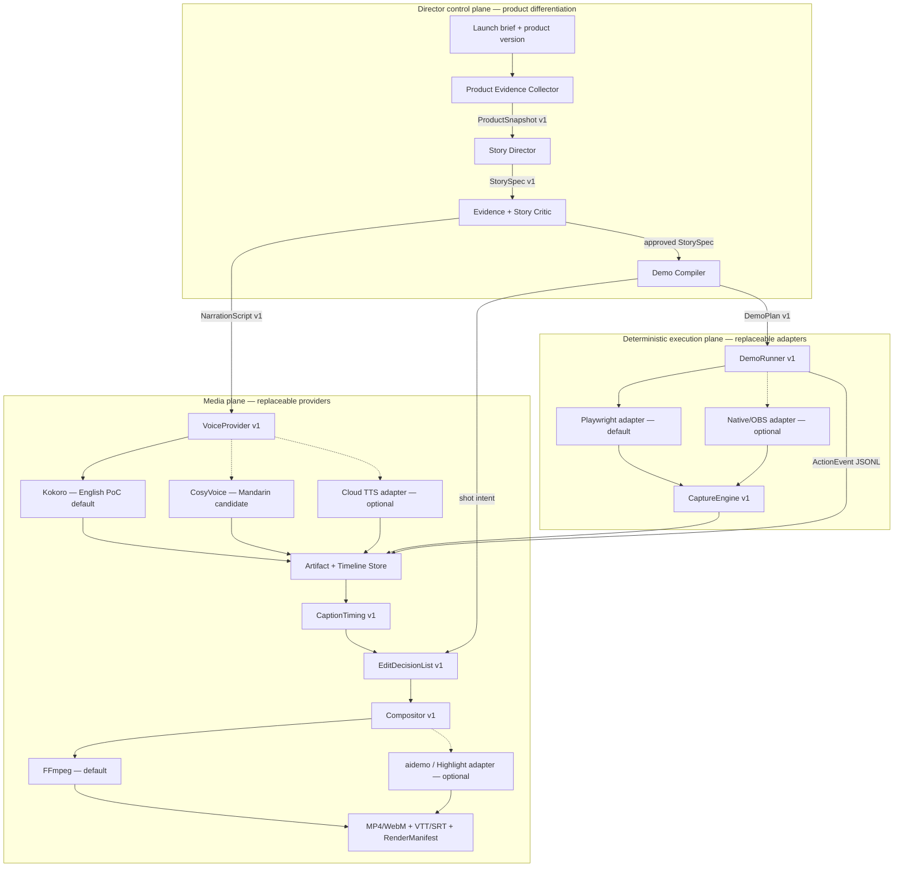

# Agent-First Product Demo Video Pipeline — Architecture

**Status:** Proposed for technical spike; no implementation has started  
**Date:** 2026-07-19

## Architecture diagram

Solid arrows are the proposed default route. Dashed arrows are optional adapters and must not leak vendor-specific fields into the canonical contracts.

## Canonical contracts

| Contract | Produced by | Consumed by | Minimum content |
|---|---|---|---|
| `ProductSnapshot v1` | Evidence Collector | Story Director | Product/release identifier, verified capabilities, audience facts, evidence references, test fixture |
| `StorySpec v1` | Story Director | Critic, Demo Compiler, Voice | objective, audience, promise, scenes, narration, evidence supporting each claim |
| `DemoPlan v1` | Demo Compiler | DemoRunner | deterministic actions, selectors, frame scopes, waits, assertions, reset instructions, shot intent |
| `ActionEvent JSONL` | DemoRunner | Timeline Store | monotonic timestamp, action/result, target bounds, cursor position, screenshot/trace references |
| `CaptureManifest v1` | CaptureEngine | Timeline Store | file hashes, dimensions, FPS/time base, start/end timestamps, capture engine/version |
| `NarrationManifest v1` | VoiceProvider | Timeline Store | script segment, audio path/hash, measured duration, voice/model/version |
| `CaptionTiming v1` | Caption service | EDL builder | caption text, start/end, language, timing source and confidence |
| `EditDecisionList v1` | EDL builder | Compositor | cuts, clip order, camera moves, overlays, audio, captions, output profile |
| `RenderManifest v1` | Compositor | QA/publisher | input hashes, tool versions, codec/config, output hashes, warnings |

## Execution invariants

1. An LLM may discover and plan, but it is not allowed in the timed capture loop. Capture replays a validated `DemoPlan`.
2. Every provider is callable through a non-interactive CLI or job API with `start`, `status`, `cancel`, structured errors, and machine-readable manifests.
3. Rehearsal and recording use the same compiled plan. Rehearsal validates selectors, assertions, fixture state, narration length, and secret-redaction rules.
4. Vendor-specific features are translated at adapter boundaries. `StorySpec` and `DemoPlan` never become an aidemo, Highlight Studio, Remotion, or TTS-vendor schema.
5. A run pins product Git SHA, fixture ID, browser and tool versions, viewport, locale/timezone, fonts, model/voice revisions, output profile, and hashes of every input artifact.
6. GUI applications may be optional render/capture adapters only when they can run unattended after one-time installation and permission setup. They are never required for the default pipeline.
